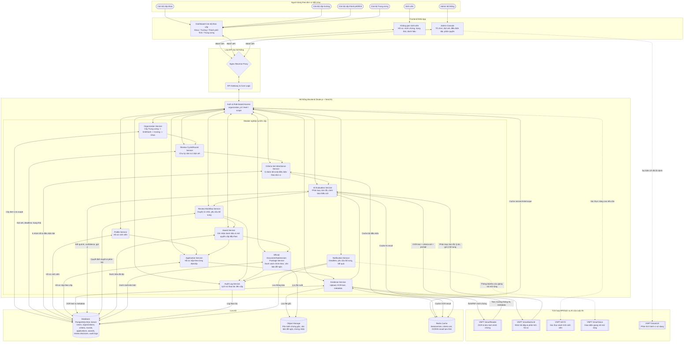

# Proposal Vòng 1 - HackAIthon 2026

> Bản miêu tả ý tưởng cho Bảng B - Challenger. Sau khi hoàn thiện thông tin đội thi và hình minh họa, có thể trình bày lại bằng `.docx`, `.pptx` hoặc công cụ thiết kế khác và xuất sang `.pdf` để nộp.

## Trang bìa

- **Tên sản phẩm/dự án:** Hệ sinh thái phong trào Sinh viên 5 tốt
- **Tên tiếng Anh:** 5-Star Eco
- **Bảng thi:** Bảng B - Challenger
- **Hướng đề tài:** Ứng dụng AI tối ưu hóa quy trình quản lý, xét duyệt và phát triển phong trào Sinh viên 5 tốt
- **Tên đội:** `<Tên đội>`
- **Trường/Đơn vị:** `<Tên trường/đơn vị>`
- **Ngày nộp:** `<dd/mm/yyyy>`

## 1. Thông tin đội thi

| STT | Họ tên | Trường/Lớp/Khoa | Vai trò trong đội | Email | Số điện thoại |
|---:|---|---|---|---|---|
| 1 |  |  | Trưởng nhóm/Product |  |  |
| 2 |  |  | Kỹ thuật/Backend |  |  |
| 3 |  |  | Frontend/UI/UX |  |  |
| 4 |  |  | AI/Data/Prompt |  |  |
| 5 |  |  | Research/Pitch |  |  |

**Người đại diện liên hệ:** `<Họ tên - SĐT - Email>`

## 2. Tóm tắt ý tưởng

**5-Star Eco - Hệ sinh thái phong trào Sinh viên 5 tốt** là nền tảng số hóa hành trình phấn đấu, nộp hồ sơ, bổ sung minh chứng và xét duyệt danh hiệu **Sinh viên 5 tốt** theo mô hình liên cấp. Thay vì sinh viên phải tự gom hồ sơ rời rạc, nộp lại nhiều lần qua từng cấp và cán bộ phải xử lý thủ công bằng Google Form, Excel, file PDF hoặc bản cứng, hệ thống tạo một quy trình thống nhất qua 4 cấp danh hiệu:

1. **Cấp khoa/viện/bộ môn**
2. **Cấp trường**
3. **Cấp thành phố/tỉnh**
4. **Cấp Trung ương**

Mỗi năm, hệ thống mở 4 đợt xét tương ứng với 4 cấp: khoa -> trường -> thành phố/tỉnh -> Trung ương. Ở mỗi đợt, sinh viên đủ điều kiện được nộp, chỉnh sửa hoặc bổ sung hồ sơ trong thời gian cho phép. Khi đến deadline, cổng hồ sơ khóa lại; cán bộ cấp tương ứng đăng nhập theo đúng đơn vị triển khai để xét duyệt. AI hỗ trợ đọc minh chứng, phân loại theo 5 nhóm tốt, phát hiện thiếu sót, tóm tắt hồ sơ và gợi ý trạng thái, nhưng **quyết định cuối cùng vẫn thuộc về cán bộ phụ trách**.

Điểm cốt lõi của 5-Star Eco là mô hình tổ chức dạng cây:

```text
Trung ương
-> Thành phố/Tỉnh
-> Trường đại học
-> Khoa/Viện/Bộ môn
```

Cán bộ cấp thành phố Hồ Chí Minh chỉ xử lý hồ sơ thuộc TP.HCM; cán bộ Trường Đại học Khoa học Tự nhiên chỉ xử lý hồ sơ thuộc trường đó; cán bộ Khoa Công nghệ thông tin của Trường Đại học Khoa học Tự nhiên khác với cán bộ Khoa Công nghệ thông tin của Trường Đại học Công nghệ Thông tin. Hệ thống dùng `organization_id`, `parent_id`, `level` và `scope` để xác định phạm vi đăng nhập, phân quyền và dữ liệu được truy cập.

5 nhóm tốt của danh hiệu luôn cố định: **Đạo đức tốt, Học tập tốt, Thể lực tốt, Tình nguyện tốt, Hội nhập tốt**. Tuy nhiên, **bộ điều kiện đạt** cho từng nhóm tốt có thể khác nhau theo cấp và theo đơn vị triển khai. Trung ương có khung chung; mỗi thành phố/tỉnh, trường và khoa có thể có ngưỡng đạt, minh chứng, biểu mẫu, deadline và hoạt động được công nhận riêng theo kế hoạch được phân cấp.

## 3. Đặt vấn đề

### 3.1. Bối cảnh

Phong trào **Sinh viên 5 tốt** là một trong những phong trào quan trọng của sinh viên Việt Nam, khuyến khích sinh viên phát triển toàn diện ở 5 nhóm tốt: đạo đức, học tập, thể lực, tình nguyện và hội nhập. Trên thực tế, quy trình xét danh hiệu không chỉ diễn ra ở một cấp. Sinh viên thường phải đi qua hành trình nhiều tầng: xét cấp khoa, đạt cấp khoa mới xét cấp trường, đạt cấp trường mới xét cấp thành phố/tỉnh, đạt cấp thành phố/tỉnh mới xét cấp Trung ương.

Quy trình này trở nên rườm rà vì mỗi cấp có thời gian mở cổng, biểu mẫu, cách nhận minh chứng và điều kiện đạt khác nhau. Một sinh viên có thể đã nộp hồ sơ ở cấp khoa nhưng khi xét cấp trường hoặc cấp thành phố/tỉnh vẫn phải bổ sung thêm minh chứng, nộp lại quyết định/danh hiệu cấp cũ, theo dõi deadline mới và kiểm tra xem bộ điều kiện của cấp mới có khác gì so với cấp trước.

Ở phía cán bộ Đoàn - Hội, áp lực cũng tăng theo từng cấp. Cán bộ cấp khoa xử lý hồ sơ của sinh viên trong khoa; cán bộ cấp trường tổng hợp hồ sơ từ nhiều khoa; cán bộ cấp thành phố/tỉnh nhận hồ sơ từ nhiều trường; cán bộ Trung ương tiếp nhận danh sách và hồ sơ từ nhiều tỉnh/thành hoặc đơn vị trực thuộc. Nếu vẫn dùng Google Form, Excel và file rời, quá trình đối chiếu minh chứng, tổng hợp danh sách, trả hồ sơ bổ sung và lưu lịch sử xét duyệt dễ phát sinh sai sót.

Bài toán này phù hợp để ứng dụng AI vì dữ liệu đầu vào có nhiều dạng phi cấu trúc: ảnh giấy khen, chứng chỉ PDF, bảng điểm, quyết định công nhận danh hiệu cấp cũ, văn bản quy chế và bộ điều kiện theo từng đơn vị. Việc kết hợp **VNPT SmartReader**, **VNPT Smartbot/LLM**, **VNPT eKYC**, **VNPT SmartVoice** và **VNPT SmartUX** giúp biến quy trình thủ công thành một hệ sinh thái minh bạch, có khả năng tự động hỗ trợ nhưng vẫn giữ quyền quyết định cuối cùng cho con người.

### 3.2. Khách hàng mục tiêu và người dùng cuối

| Nhóm | Mô tả | Pain-point chính | Nhu cầu |
|---|---|---|---|
| Đơn vị triển khai phong trào | Trung ương Hội Sinh viên Việt Nam, Hội Sinh viên cấp thành phố/tỉnh, trường, khoa/viện/bộ môn | Quy trình xét duyệt phân tán, khó chuẩn hóa, khó theo dõi trạng thái liên cấp | Nền tảng quản lý tập trung, phân quyền theo cây tổ chức, cấu hình được bộ điều kiện theo từng đơn vị |
| Sinh viên | Người phấn đấu danh hiệu Sinh viên 5 tốt | Không biết mình đủ điều kiện cấp nào, thiếu minh chứng gì, deadline nào đang mở | Cổng hồ sơ thống nhất, gợi ý bổ sung, tái sử dụng hồ sơ cấp cũ, theo dõi danh hiệu đã đạt |
| Cán bộ cấp khoa | Cán bộ phụ trách phong trào tại khoa/viện/bộ môn | Xét hồ sơ ban đầu với nhiều minh chứng rời rạc, dễ sót minh chứng hoặc sai biểu mẫu | Dashboard theo khoa, AI đọc minh chứng, lọc hồ sơ thiếu/đủ và chốt danh sách cấp khoa |
| Cán bộ cấp trường | Hội Sinh viên trường hoặc Đoàn trường nếu chưa có Hội Sinh viên | Tổng hợp hồ sơ từ nhiều khoa, kiểm tra điều kiện đã đạt cấp khoa | Dashboard theo trường, kiểm tra điều kiện đầu vào, xét cấp trường, gửi danh sách lên thành phố/tỉnh |
| Cán bộ cấp thành phố/tỉnh | Hội Sinh viên cấp thành phố/tỉnh | Nhận hồ sơ từ nhiều trường, tiêu chí địa phương có thể khác nhau, cần chốt danh sách lên Trung ương | Dashboard theo địa bàn, tổng hợp danh sách chính thức, quản lý hồ sơ đủ điều kiện xét Trung ương |
| Cán bộ Trung ương | Cán bộ Trung ương Hội Sinh viên Việt Nam | Tiếp nhận hồ sơ từ nhiều tỉnh/thành, cần lịch sử xét duyệt rõ ràng và danh sách chính thức | Dashboard Trung ương, xem lịch sử liên cấp, duyệt cuối, chốt danh hiệu cấp Trung ương |

### 3.3. Pain-point có số liệu chứng minh

| Pain-point | Số liệu/dẫn chứng sơ bộ | Hậu quả nếu không giải quyết |
|---|---|---|
| Hồ sơ rời rạc và nộp lặp lại nhiều lần | Một sinh viên có thể phải nộp/bổ sung hồ sơ qua 4 cấp trong cùng một chu kỳ xét | Mất thời gian, dễ thất lạc minh chứng, sinh viên không biết hồ sơ cấp cũ còn dùng được hay không |
| Cán bộ quá tải khi xét duyệt thủ công | Với trường quy mô 20.000 sinh viên, mỗi mùa xét có thể cần hàng chục cán bộ xử lý hồ sơ trong nhiều tuần | Dễ duyệt nhầm, sót hồ sơ, chậm công bố kết quả, khó truy vết trách nhiệm |
| Tiêu chí triển khai khác nhau theo đơn vị | Cùng 5 nhóm tốt nhưng mỗi khoa/trường/tỉnh có thể có ngưỡng điểm, minh chứng, deadline, biểu mẫu riêng | Nếu hard-code một bộ tiêu chí chung, hệ thống không phản ánh đúng thực tế vận hành |
| Thiếu minh bạch khi chuyển hồ sơ lên cấp cao hơn | Hồ sơ cấp thành phố/tỉnh gửi lên Trung ương cần danh sách chính thức, văn bản đề nghị và lịch sử xét duyệt | Nếu thiếu audit log và gói hồ sơ chuẩn, việc kiểm tra lại rất tốn công |
| Dữ liệu minh chứng phi cấu trúc | Giấy khen, chứng chỉ, bảng điểm, quyết định công nhận thường ở dạng ảnh/PDF | Cán bộ phải đọc thủ công, nhập lại dữ liệu và phân loại bằng mắt thường |

## 4. Cách giải quyết

### 4.1. Giải pháp đề xuất

5-Star Eco đề xuất một nền tảng Web App liên cấp, trong đó mỗi sinh viên có một hồ sơ nền xuyên suốt quá trình phấn đấu Sinh viên 5 tốt. Hồ sơ này được tái sử dụng qua từng cấp xét, cho phép sinh viên bổ sung minh chứng mới khi lên cấp cao hơn thay vì phải nộp lại từ đầu.

Hệ thống quản lý cây tổ chức với root là Trung ương, dưới đó là các thành phố/tỉnh, dưới mỗi thành phố/tỉnh là các trường, dưới mỗi trường là các khoa/viện/bộ môn. Mỗi tài khoản cán bộ được gắn với một đơn vị cụ thể và chỉ nhìn thấy hồ sơ trong phạm vi được phân quyền. Ví dụ, cán bộ cấp thành phố Hồ Chí Minh nhìn thấy hồ sơ từ các trường thuộc TP.HCM; cán bộ Trường Đại học Khoa học Tự nhiên nhìn thấy hồ sơ thuộc trường; cán bộ Khoa Công nghệ thông tin của trường đó chỉ nhìn thấy sinh viên thuộc khoa mình.

Mỗi năm, admin hoặc đơn vị có thẩm quyền tạo chu kỳ xét gồm 4 đợt: cấp khoa, cấp trường, cấp thành phố/tỉnh và cấp Trung ương. Mỗi đợt có thời gian mở cổng, deadline, bộ điều kiện đạt, biểu mẫu và phạm vi đơn vị riêng. Khi cổng mở, sinh viên đủ điều kiện được nộp hoặc bổ sung hồ sơ. Khi cổng khóa, sinh viên không thể tự chỉnh sửa, trừ trường hợp cán bộ/admin mở lại theo quy trình đặc biệt.

AI đóng vai trò trợ lý xử lý hồ sơ: OCR minh chứng, trích xuất thông tin, phân loại minh chứng vào 5 nhóm tốt, so sánh với bộ điều kiện đúng cấp/đúng đơn vị/đúng năm, tóm tắt hồ sơ cho cán bộ và cảnh báo trường hợp thiếu minh chứng cấp cũ. Tuy nhiên, AI không tự cấp danh hiệu. Mọi quyết định duyệt, từ chối hoặc yêu cầu bổ sung đều do cán bộ phụ trách xác nhận và được lưu audit log.

### 4.2. Nhóm chức năng chính

| Nhóm chức năng | Người dùng | Mô tả | Giá trị mang lại |
|---|---|---|---|
| Quản lý cây tổ chức | Admin, cán bộ các cấp | Tạo cấu trúc Trung ương -> thành phố/tỉnh -> trường -> khoa; gắn tài khoản cán bộ với `organization_id`, `level`, `scope` | Phân quyền rõ ràng, tránh cán bộ xem nhầm hồ sơ ngoài phạm vi |
| Quản lý chu kỳ và đợt xét | Admin, cán bộ có thẩm quyền | Tạo năm xét, 4 đợt xét, thời gian mở/khóa cổng, trạng thái từng đợt | Chuẩn hóa quy trình xét danh hiệu theo từng năm |
| Bộ điều kiện đạt phân cấp | Admin, cán bộ các cấp | Quản lý 5 nhóm tốt cố định và bộ điều kiện đạt thay đổi theo cấp/đơn vị/năm | Phản ánh đúng thực tế mỗi đơn vị triển khai khác nhau |
| Hồ sơ sinh viên liên cấp | Sinh viên | Tạo hồ sơ nền, upload minh chứng, tái sử dụng hồ sơ cấp cũ, bổ sung minh chứng khi lên cấp cao hơn | Giảm nộp lặp lại, giúp sinh viên theo dõi hành trình rõ ràng |
| Xử lý minh chứng bằng AI | Sinh viên, cán bộ | VNPT SmartReader OCR ảnh/PDF, trích xuất metadata, gợi ý nhóm tốt, confidence score | Giảm thời gian nhập liệu và phân loại thủ công |
| Trợ lý hỏi đáp/RAG | Sinh viên, cán bộ | VNPT Smartbot/LLM trả lời theo bộ điều kiện đúng cấp, đúng đơn vị, đúng năm | Giảm nhầm lẫn khi tiêu chí mỗi đơn vị khác nhau |
| Dashboard xét duyệt theo cấp | Cán bộ khoa, trường, thành phố/tỉnh, Trung ương | Lọc hồ sơ theo trạng thái, đơn vị, nhóm tốt thiếu/đủ; duyệt, từ chối, yêu cầu bổ sung | Tăng tốc độ xét duyệt và giữ người duyệt cuối là cán bộ |
| Cấp danh hiệu và mở khóa cấp tiếp theo | Cán bộ, hệ thống | Khi hồ sơ được duyệt, hệ thống tạo `Award` cấp hiện tại và mở quyền nộp cấp cao hơn | Đảm bảo sinh viên đạt cấp dưới mới được xét cấp trên |
| Gói hồ sơ và danh sách chính thức | Cán bộ thành phố/tỉnh, Trung ương | Tổng hợp hồ sơ số hóa, danh sách chính thức, văn bản đề nghị, lịch sử xét duyệt | Phù hợp quy trình gửi hồ sơ lên cấp Trung ương |
| Audit log và thông báo | Tất cả vai trò | Ghi nhận thao tác duyệt/sửa/khóa/mở cổng; thông báo deadline, yêu cầu bổ sung, kết quả | Tăng minh bạch và truy vết |

### 4.3. Luồng sử dụng chính

1. **Khởi tạo chu kỳ:** Admin tạo năm xét và cây tổ chức mẫu gồm Trung ương, TP.HCM, Trường Đại học Khoa học Tự nhiên, Khoa Công nghệ thông tin.
2. **Cấu hình điều kiện:** Mỗi cấp cấu hình bộ điều kiện đạt cho 5 nhóm tốt theo phạm vi đơn vị mình.
3. **Mở đợt cấp khoa:** Sinh viên thuộc khoa đăng nhập, xem bộ điều kiện cấp khoa, upload minh chứng và nộp hồ sơ trước deadline.
4. **AI xử lý sơ bộ:** VNPT SmartReader OCR minh chứng; Smartbot/LLM phân loại vào 5 nhóm tốt, chỉ ra minh chứng thiếu và tóm tắt hồ sơ.
5. **Cán bộ cấp khoa duyệt:** Cán bộ Khoa Công nghệ thông tin của đúng trường đăng nhập, xem hồ sơ trong phạm vi khoa, duyệt/từ chối/yêu cầu bổ sung.
6. **Mở quyền cấp trường:** Nếu đạt cấp khoa, hệ thống tạo danh hiệu cấp khoa và cho phép sinh viên nộp cấp trường khi đợt trường mở.
7. **Lặp lại ở cấp trường và thành phố/tỉnh:** Sinh viên tái sử dụng hồ sơ cấp cũ, bổ sung minh chứng mới, cán bộ đúng đơn vị xét duyệt.
8. **Xét cấp Trung ương:** Chỉ hồ sơ đã đạt cấp thành phố/tỉnh được nộp cấp Trung ương. Cán bộ Trung ương xem lịch sử liên cấp, minh chứng, danh sách chính thức và quyết định cuối.
9. **Công bố kết quả:** Sinh viên xem danh hiệu đã đạt theo từng cấp. Nếu không đạt cấp cao hơn, sinh viên vẫn giữ danh hiệu cấp thấp đã đạt trong chu kỳ đó.

### 4.4. Vì sao cần AI?

| Tác vụ | Nếu không dùng AI | Khi dùng AI/API của cuộc thi | Giá trị tạo ra |
|---|---|---|---|
| Đọc minh chứng | Cán bộ phải mở từng ảnh/PDF, đọc và nhập lại thông tin | VNPT SmartReader OCR giấy khen, chứng chỉ, bảng điểm, quyết định công nhận | Giảm thời gian nhập liệu, chuẩn hóa dữ liệu đầu vào |
| Phân loại minh chứng | Cán bộ tự xác định minh chứng thuộc nhóm tốt nào | LLM gợi ý minh chứng thuộc Đạo đức tốt, Học tập tốt, Thể lực tốt, Tình nguyện tốt hoặc Hội nhập tốt | Tăng tốc độ kiểm tra, giảm bỏ sót |
| Hỏi đáp quy định | Sinh viên đọc nhiều văn bản, dễ nhầm bộ điều kiện của đơn vị khác | VNPT Smartbot/RAG trả lời theo đúng `criteria_set` của cấp, đơn vị và năm xét | Hướng dẫn cá nhân hóa theo bối cảnh thật |
| Kiểm tra hồ sơ cấp cao | Cán bộ phải tự kiểm tra sinh viên đã đạt cấp dưới chưa | Hệ thống kiểm tra `Award` cấp cũ và AI cảnh báo thiếu minh chứng danh hiệu cấp dưới | Đảm bảo đúng quy tắc chuyển cấp |
| Tóm tắt cho cán bộ | Cán bộ đọc toàn bộ hồ sơ dài và nhiều file | LLM tóm tắt điểm mạnh, điểm thiếu, minh chứng cần xem kỹ | Giảm tải nhưng vẫn giữ cán bộ duyệt cuối |
| Xác thực danh tính | Kiểm tra thủ công thẻ sinh viên/CCCD nếu cần | VNPT eKYC hỗ trợ xác thực danh tính sinh viên ở các bước nhạy cảm | Tăng độ tin cậy, giảm rủi ro giả mạo |
| Cải thiện trải nghiệm | Khó biết sinh viên hay vướng ở bước nào | VNPT SmartUX theo dõi hành vi sử dụng ở mức phù hợp | Tối ưu giao diện, giảm tỉ lệ bỏ dở hồ sơ |

## 5. Tính đổi mới và khác biệt

### 5.1. Giải pháp hiện có

Các đơn vị hiện thường sử dụng một hoặc kết hợp nhiều cách sau:

| Giải pháp hiện có | Cách vận hành | Hạn chế |
|---|---|---|
| Google Form/Microsoft Form | Sinh viên điền form, upload file; cán bộ tải về xét | Dữ liệu rời rạc, khó theo dõi liên cấp, khó phân quyền theo cây tổ chức |
| Excel/Google Sheet | Cán bộ tổng hợp danh sách và trạng thái xét duyệt | Dễ sai khi nhiều người cùng thao tác, thiếu audit log, khó xử lý file minh chứng |
| Email/Fanpage/Zalo | Sinh viên hỏi đáp và gửi bổ sung qua kênh chat | Thông tin phân tán, dễ nhầm deadline, không có dữ liệu chuẩn |
| Phần mềm quản lý hồ sơ chung | Lưu hồ sơ và file đính kèm | Thường không mô hình hóa quy trình 4 cấp và bộ điều kiện đạt khác nhau theo đơn vị |
| Chatbot hỏi đáp đơn lẻ | Trả lời câu hỏi quy chế chung | Không gắn với hồ sơ, minh chứng, trạng thái xét và cây tổ chức |

### 5.2. So sánh khác biệt

| Tiêu chí | Cách làm hiện tại | 5-Star Eco | Khác biệt |
|---|---|---|---|
| Mô hình tổ chức | Thường theo từng trường/khoa riêng lẻ | Cây tổ chức Trung ương -> tỉnh/thành -> trường -> khoa | Phù hợp vận hành liên cấp |
| Quy trình xét | Chủ yếu thu hồ sơ cuối kỳ | 4 đợt xét theo cấp, có mở/khóa cổng, trạng thái và audit log | Theo đúng hành trình danh hiệu |
| Tiêu chí | Dễ hard-code hoặc ghi trong văn bản rời | 5 nhóm tốt cố định, bộ điều kiện đạt cấu hình theo cấp/đơn vị/năm | Linh hoạt với thực tế triển khai |
| Hồ sơ sinh viên | Nộp lại nhiều lần | Hồ sơ nền được tái sử dụng, bổ sung theo cấp | Giảm rườm rà |
| Điều kiện lên cấp | Kiểm tra thủ công | Tạo `Award` khi đạt cấp dưới và tự kiểm tra trước khi nộp cấp trên | Giảm sai sót chuyển cấp |
| AI | Nếu có thì thường chỉ OCR hoặc chatbot riêng lẻ | OCR, RAG, tóm tắt, phân loại, cảnh báo thiếu minh chứng, eKYC mở rộng | AI gắn vào workflow thật |
| Hồ sơ gửi Trung ương | Tổng hợp thủ công | Gói hồ sơ số hóa, danh sách chính thức, văn bản đề nghị, lịch sử xét duyệt | Hỗ trợ cấp Trung ương tốt hơn |

### 5.3. Điểm mới nổi bật

- **Mô hình hóa đúng quy trình liên cấp:** không chỉ là nơi nộp file, mà là hệ sinh thái xét danh hiệu qua khoa, trường, thành phố/tỉnh và Trung ương.
- **Phân quyền theo đơn vị triển khai:** cán bộ đăng nhập theo đúng đơn vị; dữ liệu được lọc theo cây tổ chức và phạm vi quyền.
- **Bộ điều kiện đạt có kế thừa:** Trung ương ban hành khung, thành phố/tỉnh, trường và khoa có thể triển khai chi tiết riêng nhưng vẫn bám 5 nhóm tốt cố định.
- **Hồ sơ tái sử dụng qua các cấp:** sinh viên không phải nộp lại từ đầu, chỉ bổ sung phần còn thiếu hoặc minh chứng cấp cũ.
- **AI hỗ trợ đúng điểm nghẽn:** đọc minh chứng, phân loại, hỏi đáp, tóm tắt, cảnh báo thiếu sót, nhưng không thay thế cán bộ duyệt cuối.
- **Truy vết minh bạch:** mọi quyết định, thời điểm khóa/mở cổng, yêu cầu bổ sung và kết quả đều có log.

## 6. Thiết kế tổng quan

### 6.1. Kiến trúc hệ thống



### 6.2. Các module chính

| Module | Chức năng | Ghi chú triển khai |
|---|---|---|
| Auth & Role-based Access | Đăng nhập, phân quyền theo vai trò và đơn vị | Dùng `organization_id`, `level`, `scope`, JWT/session |
| Organization Service | Quản lý cây Trung ương -> tỉnh/thành -> trường -> khoa | Có `parent_id` để truy vấn phạm vi cấp dưới |
| Review Cycle/Round Service | Quản lý năm xét, 4 đợt xét, thời gian mở/khóa cổng | Trạng thái: upcoming, open, locked, reviewing, completed |
| Criteria Set Inheritance Service | Quản lý 5 nhóm tốt cố định và bộ điều kiện đạt theo cấp/đơn vị/năm | Cho phép kế thừa từ cấp trên và bổ sung điều kiện riêng |
| Profile Service | Quản lý thông tin sinh viên, trường, khoa, lớp, liên hệ | Gắn sinh viên với khoa/trường cụ thể |
| Application Service | Quản lý hồ sơ nộp theo từng đợt/cấp | Có `source_application_id`, `previous_award_id` để tái sử dụng hồ sơ |
| Evidence Service | Upload minh chứng, lưu file, OCR text, metadata | Tích hợp Object Storage và VNPT SmartReader |
| AI Evaluation Service | Phân loại minh chứng, tóm tắt hồ sơ, phát hiện thiếu sót | Tích hợp VNPT Smartbot/LLM, cache kết quả AI |
| Review Workflow Service | Duyệt, từ chối, yêu cầu bổ sung, khóa hồ sơ | Cán bộ là người quyết định cuối |
| Award Service | Ghi nhận danh hiệu đã đạt theo cấp | Dùng để mở quyền xét cấp tiếp theo |
| Official Document/Submission Package Service | Tạo danh sách chính thức, văn bản đề nghị, gói hồ sơ gửi cấp trên | Đặc biệt quan trọng cho cấp thành phố/tỉnh gửi Trung ương |
| Notification Service | Nhắc deadline, thông báo yêu cầu bổ sung, kết quả | Có thể mở rộng SMS/email/Zalo |
| Audit Log Service | Ghi log thao tác, quyết định, thời điểm, người thực hiện | Tăng minh bạch và truy vết |

### 6.3. API/AI dự kiến sử dụng

| Dịch vụ/API | Cách sử dụng trong 5-Star Eco | Phạm vi MVP |
|---|---|---|
| VNPT SmartReader | OCR giấy khen, chứng chỉ, bảng điểm, quyết định công nhận danh hiệu cấp cũ | Core MVP |
| VNPT Smartbot/LLM | RAG hỏi đáp theo bộ điều kiện đúng đơn vị; phân tích, tóm tắt hồ sơ | Core MVP |
| VNPT eKYC | Xác thực danh tính sinh viên khi tạo hồ sơ hoặc trước khi nộp cấp cao | Có thể demo hoặc đưa vào mở rộng |
| VNPT SmartVoice | Hỏi đáp bằng giọng nói cho sinh viên/cán bộ | Mở rộng nếu còn thời gian |
| VNPT SmartUX | Phân tích hành vi sử dụng, phát hiện bước sinh viên hay bỏ dở | Mở rộng sau MVP |
| Object Storage API | Lưu minh chứng gốc, file văn bản đề nghị, danh sách xuất | Core MVP |
| Notification API | Gửi email/thông báo deadline và yêu cầu bổ sung | Mô phỏng trong MVP |

### 6.4. Dữ liệu sử dụng

| Nhóm dữ liệu | Nội dung | Nguồn hợp pháp/dự kiến |
|---|---|---|
| Hồ sơ sinh viên | MSSV, họ tên, khoa, trường, lớp, email, số điện thoại | Sinh viên tự cung cấp hoặc dữ liệu demo đã ẩn thông tin |
| Cây tổ chức | Trung ương, thành phố/tỉnh, trường, khoa, quan hệ cha-con | Tạo dữ liệu mẫu cho demo; khi triển khai lấy từ đơn vị vận hành |
| Bộ điều kiện đạt | 5 nhóm tốt, ngưỡng đạt, minh chứng yêu cầu, deadline, biểu mẫu | Nhập từ kế hoạch/quy chế của từng cấp, từng đơn vị |
| Minh chứng | Giấy khen, chứng chỉ, bảng điểm, ảnh/PDF hoạt động, quyết định đạt cấp cũ | Sinh viên upload với sự đồng ý; MVP dùng file mẫu |
| Kết quả AI | OCR text, metadata, nhóm tốt được gợi ý, confidence, tóm tắt | Sinh ra từ VNPT SmartReader/Smartbot |
| Quyết định xét duyệt | Duyệt, từ chối, yêu cầu bổ sung, lý do, người duyệt, thời gian | Cán bộ nhập trên dashboard |
| Danh hiệu/Award | Cấp đạt, đơn vị cấp, thời điểm, quyết định/chứng nhận | Tạo khi cán bộ duyệt đạt |
| Audit log | Lịch sử đăng nhập, nộp hồ sơ, khóa/mở cổng, duyệt/từ chối | Hệ thống tự ghi |

## 7. Phương hướng triển khai

### 7.1. Phạm vi MVP

MVP HackAIthon tập trung chứng minh logic liên cấp nhưng không cần triển khai đầy đủ mọi nghiệp vụ hành chính ở quy mô toàn quốc. Demo đề xuất dùng một cây tổ chức mẫu:

```text
Trung ương Hội Sinh viên Việt Nam
-> Hội Sinh viên Thành phố Hồ Chí Minh
-> Trường Đại học Khoa học Tự nhiên
-> Khoa Công nghệ thông tin
```

MVP bắt buộc:

- Đăng nhập giả lập theo vai trò: sinh viên, cán bộ khoa, cán bộ trường, cán bộ thành phố/tỉnh, cán bộ Trung ương, admin.
- Mỗi cán bộ chỉ thấy dữ liệu trong đúng phạm vi đơn vị của mình.
- Tạo 1 chu kỳ xét với 4 đợt: khoa, trường, thành phố/tỉnh, Trung ương.
- Tạo bộ điều kiện đạt mẫu khác nhau cho từng cấp/đơn vị nhưng cùng bám 5 nhóm tốt cố định.
- Sinh viên nộp hồ sơ cấp khoa, upload minh chứng, nhận phân tích AI.
- Cổng hồ sơ khóa sau deadline.
- Cán bộ cấp khoa duyệt; nếu đạt, hệ thống tạo danh hiệu cấp khoa và mở quyền nộp cấp trường.
- Lặp lại luồng nộp/bổ sung/duyệt ở cấp trường và thành phố/tỉnh.
- Cấp Trung ương xem hồ sơ đã đạt cấp thành phố/tỉnh, lịch sử xét duyệt liên cấp và duyệt cuối.
- Có màn hình trạng thái danh hiệu đã đạt của sinh viên theo 4 cấp.

Phần có thể mô phỏng:

- Văn bản đề nghị gửi Trung ương.
- Danh sách chính thức cấp thành phố/tỉnh gửi Trung ương.
- Chứng nhận/danh hiệu cấp cũ dạng file.
- CSDL đối chiếu minh chứng bên ngoài.

### 7.2. Kế hoạch kỹ thuật build/deploy

| Thành phần | Công nghệ đề xuất | Ghi chú |
|---|---|---|
| Frontend | React/Next.js hoặc Vite + React | Giao diện sinh viên, dashboard cán bộ, admin console |
| Backend | Node.js + NestJS | Module hóa theo Auth, Organization, Criteria, Application, Evidence, Review, Award |
| Reverse Proxy | Nginx | Routing API, cấu hình deploy |
| Database | PostgreSQL hoặc SQL Server | Lưu dữ liệu quan hệ: tổ chức, tiêu chí, hồ sơ, award, audit log |
| Cache | Redis | Cache session/role/scope, bộ điều kiện, kết quả OCR/AI tạm thời |
| File Storage | S3-compatible Object Storage | Lưu minh chứng, văn bản, danh sách xuất |
| AI/API Adapter | Service adapter cho VNPT SmartReader, Smartbot, eKYC, SmartVoice, SmartUX | Dễ mock khi API lỗi hoặc demo offline |
| Deploy | Vercel cho frontend; VPS/Cloud VM/Docker cho backend | MVP có thể chạy bằng Docker Compose |

Kế hoạch triển khai kỹ thuật:

1. Thiết kế database cho `Organization`, `User`, `Role`, `ReviewCycle`, `ReviewRound`, `CriteriaSet`, `Application`, `Evidence`, `Award`, `ReviewDecision`, `AuditLog`.
2. Xây backend NestJS với guard phân quyền theo `organization_id`, `level`, `scope`.
3. Xây frontend 3 không gian chính: sinh viên, cán bộ, admin.
4. Tích hợp VNPT SmartReader cho OCR minh chứng; xây adapter mock fallback.
5. Tích hợp VNPT Smartbot/LLM cho phân loại, tóm tắt và hỏi đáp RAG.
6. Hoàn thiện flow demo 4 cấp với dữ liệu mẫu.
7. Kiểm thử phân quyền, khóa deadline, điều kiện chuyển cấp và người duyệt cuối.

### 7.3. Nguồn lực nhân sự

| Vai trò | Nhiệm vụ |
|---|---|
| Product/Research | Chốt flow nghiệp vụ 4 cấp, mô hình cây tổ chức, nội dung proposal và pitch |
| Backend | Thiết kế database, NestJS API, phân quyền theo đơn vị, tích hợp AI/API |
| Frontend/UI/UX | Xây giao diện sinh viên, dashboard cán bộ, admin console |
| AI/Data/Prompt | Thiết kế prompt phân loại minh chứng, RAG theo bộ điều kiện, kịch bản OCR |
| QA/Demo/Pitch | Tạo dữ liệu demo, kiểm thử luồng 4 cấp, chuẩn bị video/thuyết trình |

### 7.4. Ước tính chi phí hạ tầng và vận hành

| Hạng mục | Chi phí MVP dự kiến | Ghi chú |
|---|---:|---|
| Frontend hosting | 0 - 300.000 VNĐ/tháng | Vercel/Netlify/free tier |
| Backend server | 200.000 - 800.000 VNĐ/tháng | VPS nhỏ hoặc cloud free credit |
| Database | 0 - 500.000 VNĐ/tháng | PostgreSQL managed/free tier hoặc self-host |
| Redis | 0 - 300.000 VNĐ/tháng | Free tier hoặc chạy cùng server demo |
| Object Storage | 0 - 300.000 VNĐ/tháng | Tùy dung lượng minh chứng |
| VNPT AI/API | Theo quota cuộc thi hoặc gói API được cấp | MVP cần cache và fallback để kiểm soát chi phí |
| Domain/SSL | 0 - 300.000 VNĐ/năm | Có thể dùng domain tạm cho demo |

### 7.5. An toàn, bảo mật và pháp lý

Nguyên tắc thiết kế:

- Thu thập dữ liệu cá nhân có mục đích rõ ràng và có sự đồng ý của sinh viên.
- Phân quyền theo vai trò và đơn vị triển khai; cán bộ chỉ xem dữ liệu trong phạm vi được giao.
- Không public file minh chứng; sử dụng signed URL hoặc cơ chế truy cập có thời hạn.
- Không lưu API key/token trong mã nguồn; dùng biến môi trường hoặc secret manager.
- Ghi audit log cho thao tác nộp, sửa, khóa/mở cổng, duyệt, từ chối và yêu cầu bổ sung.
- AI chỉ đưa ra gợi ý; quyết định danh hiệu là của cán bộ phụ trách.
- Dữ liệu demo được ẩn thông tin nhạy cảm hoặc xóa sau cuộc thi.
- Khi triển khai thật, tuân thủ quy định hiện hành tại Việt Nam về bảo vệ dữ liệu cá nhân.

**Cam kết thiết kế:**

- [x] Không commit API key/token thật lên repo.
- [x] Có phân quyền theo vai trò và đơn vị.
- [x] Có log thao tác xét duyệt liên cấp.
- [x] Không công khai file/dữ liệu nhạy cảm.
- [x] Có cơ chế khóa hồ sơ sau deadline.
- [x] AI không tự quyết định kết quả cuối cùng.

### 7.6. Roadmap sau cuộc thi / GTM

| Giai đoạn | Thời gian | Mục tiêu | Đầu ra |
|---|---|---|---|
| Pilot | 0-3 tháng | Kiểm chứng MVP tại 1 khoa/trường hoặc cây tổ chức mẫu | Luồng 4 cấp demo, dashboard cán bộ, OCR/AI cơ bản, feedback người dùng |
| Mở rộng ban đầu | 3-6 tháng | Triển khai cho nhiều khoa trong một trường hoặc nhiều trường trong một thành phố | Quản lý nhiều đơn vị, cấu hình tiêu chí theo đơn vị, báo cáo tổng hợp |
| Tối ưu sản phẩm | 6-9 tháng | Bổ sung văn bản đề nghị, danh sách chính thức, audit nâng cao, SmartUX | Quy trình gửi hồ sơ cấp thành phố/tỉnh lên Trung ương rõ ràng hơn |
| Triển khai rộng | 9-12 tháng | Hướng tới mô hình hệ sinh thái dùng cho nhiều tỉnh/thành và trường | Hệ thống multi-tenant, phân quyền mạnh, tài liệu vận hành và gói triển khai |

## 8. Tác động dự kiến

### 8.1. Lợi ích xã hội/kinh doanh

| Nhóm hưởng lợi | Lợi ích cụ thể | Cách đo lường |
|---|---|---|
| Sinh viên | Biết mình đủ điều kiện cấp nào, còn thiếu gì, deadline nào đang mở; tái sử dụng hồ sơ cấp cũ | Tỷ lệ hoàn thiện hồ sơ đúng hạn, thời gian phát hiện thiếu minh chứng, mức hài lòng |
| Cán bộ cấp khoa/trường | Giảm thời gian đọc minh chứng, lọc hồ sơ, tổng hợp danh sách | Thời gian xử lý trung bình/hồ sơ, số hồ sơ xử lý/ngày, tỷ lệ hồ sơ bị trả bổ sung |
| Cán bộ cấp thành phố/tỉnh | Nhận hồ sơ từ nhiều trường có cấu trúc chuẩn, dễ tổng hợp danh sách chính thức | Thời gian chốt danh sách, số lỗi khi gửi lên cấp cao hơn |
| Cán bộ Trung ương | Xem được lịch sử xét duyệt liên cấp, hồ sơ số hóa và danh sách chính thức | Thời gian kiểm tra hồ sơ cấp Trung ương, tỷ lệ hồ sơ có đủ lịch sử/minh chứng |
| Đơn vị triển khai | Chuẩn hóa quy trình nhưng vẫn linh hoạt theo điều kiện riêng | Số đơn vị tham gia, số bộ điều kiện được cấu hình, tỷ lệ quy trình được số hóa |
| Hệ thống phong trào Sinh viên 5 tốt | Tăng minh bạch, giảm sai sót, tạo dữ liệu dài hạn về hành trình phấn đấu của sinh viên | Số danh hiệu được ghi nhận theo cấp, số hồ sơ liên cấp, chất lượng báo cáo |

### 8.2. TAM - SAM - SOM hoặc người dùng tiềm năng

| Chỉ số | Định nghĩa trong bài toán | Ước tính sơ bộ | Cơ sở ước tính |
|---|---|---:|---|
| TAM | Toàn bộ sinh viên đại học/cao đẳng, cán bộ Đoàn - Hội và đơn vị triển khai phong trào Sinh viên 5 tốt trên toàn quốc | 2.000.000+ sinh viên; hàng trăm trường/đơn vị | Phong trào có thể triển khai ở nhiều cấp: khoa, trường, thành phố/tỉnh, Trung ương |
| SAM | Nhóm có thể tiếp cận trong 1-2 năm đầu: trường/khoa/tỉnh thành có nhu cầu số hóa xét duyệt | 100.000-300.000 sinh viên; 20-50 đơn vị | Ưu tiên nơi đang xử lý bằng Google Form/Excel và có lượng hồ sơ lớn |
| SOM | Phần có thể đạt sau cuộc thi: pilot tại 1-3 khoa/trường hoặc một cụm đơn vị nhỏ | 500-3.000 sinh viên; 300-1.000 hồ sơ/mùa xét | Phù hợp kiểm chứng MVP, OCR, dashboard và luồng liên cấp |

### 8.3. Ưu thế cạnh tranh

- **Bám sát quy trình thực tế:** 5-Star Eco xử lý đúng luồng khoa -> trường -> thành phố/tỉnh -> Trung ương, thay vì chỉ thu hồ sơ cuối kỳ.
- **Phân quyền theo cây tổ chức:** giải quyết bài toán mỗi cán bộ chỉ được xem hồ sơ thuộc đơn vị mình.
- **Tiêu chí linh hoạt nhưng có khung chung:** 5 nhóm tốt cố định, bộ điều kiện đạt cấu hình theo đơn vị và có thể kế thừa từ cấp trên.
- **AI không tách rời nghiệp vụ:** OCR, RAG, tóm tắt, phân loại và cảnh báo thiếu minh chứng nằm trong workflow xét duyệt.
- **Dễ mở rộng:** MVP có thể demo một cây tổ chức nhỏ, sau đó mở rộng nhiều trường, nhiều tỉnh/thành và cấp Trung ương.
- **Minh bạch và truy vết:** có audit log, lịch sử duyệt, danh hiệu đã đạt và gói hồ sơ gửi cấp trên.

### 8.4. Mô hình doanh thu hoặc giá trị mang lại

| Mô hình | Mô tả | Phù hợp giai đoạn nào |
|---|---|---|
| Pilot miễn phí | Cung cấp bản thử nghiệm cho một khoa/trường hoặc một mùa xét | 0-3 tháng sau cuộc thi |
| Thu phí theo đơn vị triển khai | Trường/khoa/tỉnh thành trả phí theo gói cấu hình, tài khoản cán bộ, dashboard, lưu trữ, báo cáo | Sau khi MVP ổn định |
| Thu phí theo hồ sơ/API usage | Tính theo số hồ sơ xử lý, lượt OCR, lượt hỏi RAG, dung lượng lưu trữ | Khi mở rộng nhiều đơn vị |
| Gói triển khai toàn hệ thống | Cung cấp hạ tầng, tài liệu, đào tạo, hỗ trợ vận hành cho nhiều cấp | Giai đoạn triển khai rộng |
| Giá trị xã hội | Tăng tỷ lệ sinh viên theo đuổi danh hiệu, giảm tải cán bộ, minh bạch hóa phong trào | Xuyên suốt |

## 9. Rủi ro và phương án giảm thiểu

| Rủi ro | Mức độ ảnh hưởng | Phương án giảm thiểu |
|---|---|---|
| Phân quyền sai đơn vị, cán bộ thấy hồ sơ ngoài phạm vi | Cao | Thiết kế cây tổ chức rõ ràng, dùng `organization_id`, `parent_id`, `level`, `scope`; kiểm thử role-based access theo nhiều ví dụ |
| Bộ điều kiện đạt khác nhau giữa các cấp/đơn vị | Cao | Dùng `CriteriaSet` cấu hình theo cấp, đơn vị, năm; 5 nhóm tốt cố định nhưng điều kiện đạt linh hoạt |
| OCR hoặc AI phân loại sai | Cao | Hiển thị OCR text, confidence, lý do gợi ý; cán bộ duyệt cuối; cho phép chỉnh sửa và ghi nhận phản hồi |
| SmartReader/Smartbot/eKYC lỗi hoặc chậm khi demo | Cao | Có adapter, timeout, retry, cache kết quả và dữ liệu mock fallback |
| Hồ sơ cấp cao thiếu minh chứng/danh hiệu cấp cũ | Cao | Kiểm tra `Award` cấp dưới trước khi mở quyền nộp cấp trên; AI cảnh báo thiếu file quyết định/chứng nhận |
| Sinh viên muốn sửa sau deadline | Trung bình | Khóa hồ sơ theo đợt; chỉ cán bộ/admin có quyền mở lại trong trường hợp đặc biệt và có audit log |
| Gói hồ sơ gửi Trung ương chưa đủ nghiệp vụ hành chính | Trung bình | MVP mô phỏng danh sách/văn bản; roadmap bổ sung mẫu biểu, số văn bản, ký số hoặc upload văn bản chính thức |
| Dữ liệu cá nhân nhạy cảm | Cao | Consent, phân quyền, signed URL, không public bucket, ẩn/xóa dữ liệu demo, tuân thủ quy định bảo vệ dữ liệu |
| MVP quá rộng | Trung bình | Demo một cây tổ chức mẫu, một sinh viên, một chu kỳ xét với 4 đợt; các phần SmartVoice, SmartUX, CSDL đối chiếu để mở rộng |
| Người dùng chưa tin AI | Trung bình | Trình bày AI là trợ lý, không thay thế cán bộ; mọi quyết định quan trọng đều có người xác nhận |

## 10. Video thuyết minh

Video không bắt buộc, nhưng nếu có nên dài khoảng 2-3 phút.

**Kịch bản gợi ý:**

1. Giới thiệu đội và tên sản phẩm **5-Star Eco - Hệ sinh thái phong trào Sinh viên 5 tốt**.
2. Nêu pain-point bằng ví dụ sinh viên phải xét qua khoa, trường, thành phố/tỉnh và Trung ương.
3. Mô tả mô hình cây tổ chức và cách cán bộ đăng nhập theo đơn vị.
4. Demo luồng sinh viên nộp hồ sơ cấp khoa, AI OCR/phân loại, cán bộ duyệt và mở quyền lên cấp trường.
5. Chỉ rõ VNPT SmartReader, Smartbot/LLM, eKYC, SmartVoice, SmartUX được dùng ở đâu.
6. Nêu tác động: giảm tải cán bộ, minh bạch liên cấp, giữ người duyệt cuối là cán bộ.

**Link video:** `<Dán link nếu có>`

## 11. Phụ lục

### 11.1. Wireframe/Figma

- Link Figma: `<Dán link>`
- Ảnh minh họa màn hình chính:
  - Màn hình 1: Dashboard sinh viên theo 4 cấp danh hiệu
  - Màn hình 2: Upload minh chứng và kết quả OCR/AI
  - Màn hình 3: Dashboard cán bộ theo đơn vị
  - Màn hình 4: Admin cấu hình cây tổ chức và bộ điều kiện đạt
  - Màn hình 5: Gói hồ sơ/danh sách chính thức gửi cấp trên

### 11.2. Sơ đồ kiến trúc

- Link ảnh/sơ đồ: `<Dán link hoặc chèn ảnh khi xuất PDF>`
- Sơ đồ Mermaid ở mục 6.1 có thể render thành PNG/SVG để đưa vào bản PDF.

### 11.3. Tài liệu tham khảo

- Thông báo số 1 HackAIthon 2026: `hackaithon-2026-thong-bao-so-1_1780034931.pdf`
- Trang Bảng B - Challenger: `https://hackaithon.vsds.vn/bang-b-challenger/`
- Thể lệ Bảng B: `https://hackaithon.vsds.vn/the-le-bang-b/`
- Kế hoạch ý tưởng nội bộ: `hst-sv5t.md`
- Báo cáo rà soát proposal và flow xét duyệt: `bao-cao.md`

## 12. Checklist tự đánh giá trước khi nộp

### 12.1. Tính phù hợp đề bài

- [x] Bám sát hướng ứng dụng AI vào bài toán thực tế.
- [x] Có phân tích khách hàng mục tiêu và người dùng cuối.
- [x] Có pain-point rõ ràng.
- [x] Có số liệu/dẫn chứng sơ bộ để chứng minh vấn đề.
- [x] Có giải thích "vì sao AI".

### 12.2. Tính đổi mới và khác biệt

- [x] Có liệt kê giải pháp tương tự/hiện có.
- [x] Có so sánh với Google Form, Excel, phần mềm hồ sơ và chatbot đơn lẻ.
- [x] Có chứng minh điểm khác biệt cốt lõi: liên cấp, cây tổ chức, phân quyền theo đơn vị, bộ điều kiện đạt kế thừa.
- [x] Có nêu rõ AI gắn với workflow xét duyệt, không chỉ là chatbot hỏi đáp.

### 12.3. Tính khả thi

- [x] Nguồn dữ liệu hợp pháp, MVP dùng dữ liệu mẫu/ẩn danh.
- [x] Nhân lực triển khai phù hợp.
- [x] Kỹ thuật build/deploy khả thi với Node.js + NestJS, web frontend, PostgreSQL/SQL Server, Redis, Object Storage.
- [x] Có ước tính chi phí hạ tầng và vận hành.
- [x] Có phương án bảo mật và pháp lý.
- [x] Có roadmap/GTM sau cuộc thi.

### 12.4. Tác động dự kiến

- [x] Có nêu lợi ích xã hội/kinh doanh.
- [x] Có ước tính người dùng tiềm năng/TAM-SAM-SOM.
- [x] Có phân tích ưu thế cạnh tranh.
- [x] Có mô hình doanh thu hoặc giá trị mang lại.

### 12.5. Chất lượng hồ sơ

- [x] Proposal trình bày logic, dễ đọc.
- [x] Có sơ đồ kiến trúc.
- [ ] Có wireframe hoặc hình minh họa sản phẩm.
- [x] Ngôn ngữ rõ ràng, hạn chế lỗi chính tả.
- [ ] File cuối được xuất PDF đúng định dạng.
