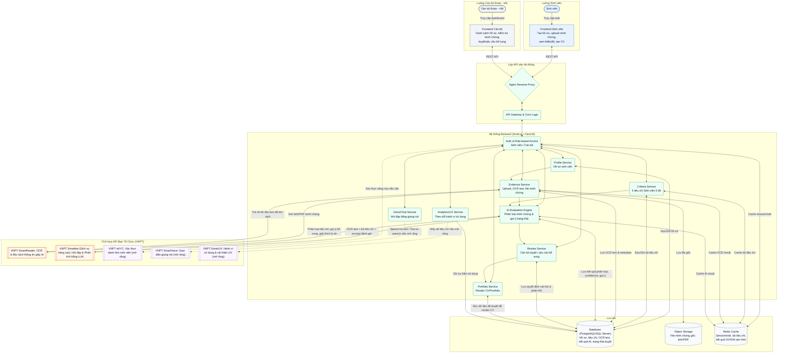
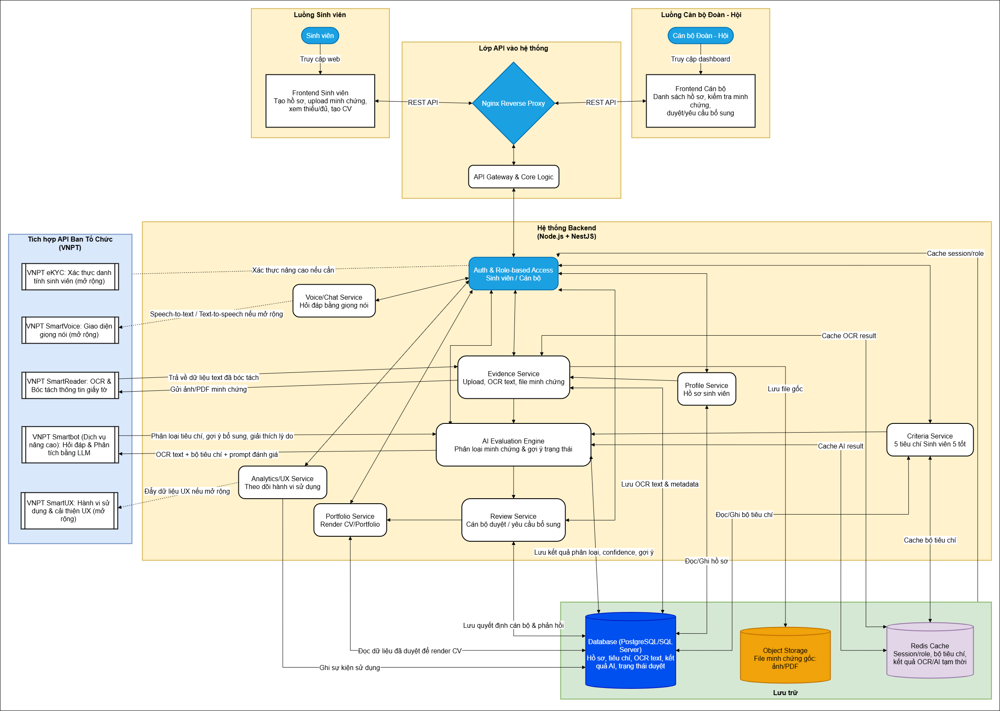

# Template Proposal Vòng 1 - HackAIthon 2026

> Dùng để soạn bản miêu tả ý tưởng. Sau khi hoàn thiện, có thể trình bày lại bằng `.docx`, `.pptx` hoặc công cụ thiết kế khác và xuất sang `.pdf` để nộp.

## Trang bìa

- **Tên sản phẩm/dự án:** `<Tên ngắn, dễ nhớ, gợi đúng vấn đề>`
- **Bảng thi:** Bảng B - Challenger
- **Hướng đề tài:** `<Chọn hướng đề tài theo BTC>`
- **Tên đội:** `<Tên đội>`
- **Trường/đơn vị:** `<Tên trường/đơn vị>`
- **Ngày nộp:** `<dd/mm/yyyy>`

## 1. Thông tin đội thi

| STT | Họ tên | Trường/Lớp/Khoa | Vai trò trong đội | Email | Số điện thoại |
|---:|---|---|---|---|---|
| 1 |  |  | Trưởng nhóm/Product |  |  |
| 2 |  |  | Kỹ thuật/Backend |  |  |
| 3 |  |  | Frontend/UI/UX |  |  |
| 4 |  |  | AI/Data/Prompt |  |  |
| 5 |  |  | Research/Pitch |  |  |

**Người đại diện liên hệ:** `<Họ tên - SĐT - Email>`

## 2. Tóm tắt ý tưởng

Viết 1-2 đoạn ngắn, trả lời nhanh:

- Sản phẩm giải quyết vấn đề gì?
- Người dùng chính là ai?
- AI được dùng ở đâu?
- Kết quả/tác động kỳ vọng là gì?

**Gợi ý viết:**

`<Tên sản phẩm>` là `<loại sản phẩm/nền tảng/trợ lý>` giúp `<nhóm người dùng>` giải quyết vấn đề `<vấn đề chính>`. Hệ thống sử dụng AI để `<năng lực AI chính>`, từ đó giúp `<lợi ích cụ thể>`. Giải pháp hướng tới `<tác động xã hội/kinh doanh>` và có thể triển khai trước ở `<phạm vi ban đầu>`.

## 3. Đặt vấn đề

### 3.1. Bối cảnh

Mô tả bối cảnh thực tế dẫn tới vấn đề:

- Vấn đề đang xảy ra ở đâu?
- Ai đang bị ảnh hưởng?
- Quy trình hiện tại đang làm như thế nào?
- Vì sao đây là bài toán đáng giải quyết?

**Nội dung cần điền:**

`<Viết 2-4 đoạn mô tả bối cảnh. Nên có dẫn chứng thực tế, quan sát từ trường/đơn vị, số lượng người dùng liên quan hoặc quy trình hiện tại.>`

### 3.2. Khách hàng mục tiêu và người dùng cuối

| Nhóm | Mô tả | Pain-point chính | Nhu cầu |
|---|---|---|---|
| Khách hàng/đơn vị triển khai |  |  |  |
| Người dùng cuối 1 |  |  |  |
| Người dùng cuối 2 |  |  |  |

### 3.3. Pain-point có số liệu chứng minh

Trình bày pain-point theo cấu trúc: **vấn đề - bằng chứng - hậu quả**.

| Pain-point | Số liệu/dẫn chứng | Hậu quả nếu không giải quyết |
|---|---|---|
|  |  |  |
|  |  |  |
|  |  |  |

**Gợi ý nguồn số liệu:**

- Khảo sát nhanh sinh viên/người dùng mục tiêu.
- Số lượng hồ sơ/quy trình đang xử lý thực tế.
- Thời gian xử lý trung bình hiện tại.
- Báo cáo công khai, thống kê của trường/đơn vị/nhà nước.
- Quan sát hoặc phỏng vấn ngắn với người dùng.

## 4. Cách giải quyết

### 4.1. Giải pháp đề xuất

Mô tả sản phẩm sẽ làm gì và giải quyết pain-point như thế nào.

`<Viết 2-4 đoạn mô tả giải pháp tổng thể. Nên nói rõ sản phẩm là web app, mobile app, chatbot, dashboard, API platform hay công cụ nội bộ.>`

### 4.2. Nhóm chức năng chính

| Nhóm chức năng | Người dùng | Mô tả | Giá trị mang lại |
|---|---|---|---|
|  |  |  |  |
|  |  |  |  |
|  |  |  |  |

### 4.3. Luồng sử dụng chính

1. `<Bước 1: Người dùng làm gì?>`
2. `<Bước 2: Hệ thống xử lý gì?>`
3. `<Bước 3: AI/API tham gia ở đâu?>`
4. `<Bước 4: Người dùng nhận kết quả gì?>`
5. `<Bước 5: Quy trình kết thúc hoặc chuyển sang bước tiếp theo thế nào?>`

### 4.4. Vì sao cần AI?

Giải thích rõ AI tạo giá trị gì mà cách truyền thống khó làm được.

| Tác vụ | Nếu không dùng AI | Khi dùng AI | Giá trị tạo ra |
|---|---|---|---|
|  |  |  |  |
|  |  |  |  |
|  |  |  |  |

**Gợi ý viết:**

- AI giúp đọc hiểu dữ liệu phi cấu trúc.
- AI giúp phân loại, dự đoán, gợi ý hoặc cá nhân hóa.
- AI giúp giảm thời gian xử lý thủ công.
- AI giúp tạo phản hồi tự nhiên, dễ hiểu.
- AI giúp phát hiện bất thường hoặc hỗ trợ ra quyết định.

## 5. Tính đổi mới và khác biệt

### 5.1. Giải pháp hiện có

Liệt kê các sản phẩm, quy trình, phần mềm, thư viện open-source hoặc cách làm thủ công hiện tại.

| Giải pháp hiện có | Mô tả ngắn | Hạn chế |
|---|---|---|
|  |  |  |
|  |  |  |
|  |  |  |

### 5.2. So sánh khác biệt

Tiêu chí đạt khi chứng minh không có sản phẩm tương tự hoặc khác biệt tối thiểu khoảng 30% tính năng cốt lõi.

| Tiêu chí so sánh | Giải pháp hiện có | Sản phẩm đề xuất | Khác biệt |
|---|---|---|---|
| Đối tượng phục vụ |  |  |  |
| Tính năng lõi |  |  |  |
| Mức độ dùng AI |  |  |  |
| Trải nghiệm người dùng |  |  |  |
| Khả năng triển khai |  |  |  |
| Giá trị/tác động |  |  |  |

### 5.3. Điểm mới nổi bật

- `<Điểm mới 1>`
- `<Điểm mới 2>`
- `<Điểm mới 3>`

## 6. Thiết kế tổng quan

### 6.1. Kiến trúc hệ thống

Kiến trúc được thiết kế theo hướng web app gồm 2 không gian sử dụng: **Sinh viên** và **Cán bộ Đoàn - Hội**. Toàn bộ lời gọi đến API AI/VNPT đi qua backend để kiểm soát phân quyền, bảo vệ API key, ghi log và lưu kết quả xử lý. Hệ thống có thêm cache để lưu session/role, bộ tiêu chí, kết quả OCR/AI tạm thời, giúp demo ổn định hơn và giảm số lần gọi API ngoài. MVP tập trung vào luồng cốt lõi: đăng nhập 2 vai trò, tạo hồ sơ, upload minh chứng, OCR, phân loại theo 5 tiêu chí Sinh viên 5 tốt, hiển thị dashboard sinh viên và dashboard cán bộ.

**Đối chiếu với phạm vi MVP ở mục 7.1:**

| Yêu cầu MVP 7.1 | Thành phần kiến trúc đáp ứng |
|---|---|
| Đăng nhập giả lập 2 vai trò, sinh viên tạo hồ sơ | `Auth`, `Profile`, `FE_S`, `FE_A` |
| Upload ảnh giấy khen/PDF bảng điểm | `Evidence`, `S3/Object Storage`, `FE_S` |
| OCR bằng VNPT SmartReader | `Evidence` gọi `VNPT SmartReader` |
| Phân loại minh chứng vào 5 tiêu chí Sinh viên 5 tốt | `Criteria`, `AI Evaluation Engine`, `VNPT Smartbot` |
| Dashboard sinh viên xem tiêu chí đạt/thiếu | `FE_S`, `Profile`, `EvalService`, `DB` |
| Dashboard cán bộ xem hồ sơ và đề xuất sơ loại | `FE_A`, `Review`, `EvalService`, `DB` |
| Cán bộ duyệt/từ chối/yêu cầu bổ sung | `Review Service` |
| RAG chatbot, eKYC, giọng nói, portfolio, UX tracking nếu mở rộng | `VNPT Smartbot`, `eKYC`, `SmartVoice`, `Portfolio`, `Analytics/UX` |

### 6.2. Các module chính

| Module | Chức năng | Input | Output |
|---|---|---|---|
|  |  |  |  |
|  |  |  |  |
|  |  |  |  |

### 6.3. API/AI dự kiến sử dụng

| API/AI | Mục đích sử dụng | Giai đoạn MVP hay mở rộng |
|---|---|---|
|  |  | MVP |
|  |  | MVP |
|  |  | Mở rộng |

### 6.4. Dữ liệu sử dụng

| Loại dữ liệu | Nguồn dữ liệu | Tính hợp pháp | Cách lưu trữ/bảo vệ |
|---|---|---|---|
|  |  |  |  |
|  |  |  |  |

## 7. Phương hướng triển khai

### 7.1. Phạm vi MVP

Thời gian phát triển ở Vòng 2 chỉ có **1 tuần (26/06 - 03/07/2026)**, do đó dự án tập trung chứng minh **luồng giá trị cốt lõi (Core Flow)**: quá trình OCR và tự động phân loại minh chứng bằng AI.

**Chức năng bắt buộc trong MVP:**

- [ ] **Quản lý tài khoản:** Đăng nhập giả lập theo 2 vai trò: Sinh viên và Cán bộ Đoàn/Hội. Sinh viên tạo hồ sơ cá nhân với dữ liệu mock.
- [ ] **Upload & Xử lý (Core):** Hỗ trợ upload ảnh chụp giấy khen và bảng điểm PDF. Tích hợp API **VNPT SmartReader** để OCR trích xuất nội dung minh chứng.
- [ ] **Phân loại AI (Core):** Xây dựng logic/prompt AI để tự động phân loại minh chứng vừa đọc được vào đúng 1 trong 5 tiêu chí của Sinh viên 5 tốt.
- [ ] **Dashboard Sinh viên:** Báo cáo trực quan hiển thị thanh tiến độ (Tiêu chí nào Đạt, tiêu chí nào Thiếu).
- [ ] **Dashboard Cán bộ:** Giao diện hiển thị danh sách hồ sơ đã nộp và kết quả đề xuất sơ loại từ AI (Duyệt/Từ chối nhanh).

**Chức năng mở rộng nếu còn thời gian:**

- [ ] RAG Chatbot hỏi đáp quy chế Sinh viên 5 tốt theo từng trường
- [ ] EKYC xác thực danh tính sinh viên khi cần tăng độ tin cậy của hồ sơ, đối chiếu ảnh/CCCD
- [ ] Giao diện giọng nói cho sinh viên hỏi đáp chatbot hoặc cán bộ duyệt hồ sơ
- [ ] Gợi ý hoạt động phù hợp với từng sinh viên
- [ ] Portfolio Generator: Tự động sinh trang CV/Portfolio từ các thành tích đã được duyệt để xuất file PDF hoặc link chia sẻ.
- [ ] Theo dõi hành vi sử dụng để cải thiện UI/UX

### 7.2. Kế hoạch kỹ thuật build/deploy

| Thành phần | Công nghệ dự kiến | Lý do chọn |
|---|---|---|
| Frontend |  |  |
| Backend | Node.js + NestJS | Có cấu trúc module/service rõ ràng, phù hợp API nhiều nghiệp vụ, dễ tích hợp OCR/AI, triển khai MVP nhanh |
| Database |  |  |
| AI/API |  |  |
| Deploy |  |  |

### 7.3. Nguồn lực nhân sự

| Vai trò | Người phụ trách | Công việc chính |
|---|---|---|
| Product/PM |  |  |
| Frontend |  |  |
| Backend |  |  |
| AI/Data |  |  |
| UX/UI |  |  |
| Pitch/Business |  |  |

### 7.4. Ước tính chi phí hạ tầng và vận hành

| Hạng mục | Chi phí MVP | Chi phí khi mở rộng | Ghi chú |
|---|---:|---:|---|
| Hosting frontend/backend |  |  |  |
| Database/storage |  |  |  |
| API/AI usage |  |  |  |
| Monitoring/logging |  |  |  |
| Tổng dự kiến |  |  |  |

### 7.5. An toàn, bảo mật và pháp lý

- Dữ liệu cá nhân nào được thu thập?
- Có xin sự đồng ý của người dùng không?
- Ai có quyền xem/sửa/xóa dữ liệu?
- API key được lưu ở đâu?
- Dữ liệu demo sau cuộc thi được xử lý thế nào?
- Giải pháp có tuân thủ quy định bảo vệ dữ liệu cá nhân tại Việt Nam không?

**Dữ liệu cá nhân nào được thu thập?**
Tên, MSSV, khoa/lớp, email, SĐT, ảnh CCCD (nếu dùng eKYC), và minh chứng hoạt động (giấy khen, chứng chỉ, bảng điểm).

**Có xin sự đồng ý của người dùng không?**
Có. Sinh viên phải đồng ý điều khoản sử dụng khi đăng ký và xác nhận consent checkbox khi upload minh chứng. Hệ thống ghi nhận thời điểm đồng ý.

**Ai có quyền xem/sửa/xóa dữ liệu?**
- Sinh viên: chỉ xem/sửa/xóa hồ sơ và minh chứng của chính mình.
- Cán bộ Đoàn/Hội: chỉ xem hồ sơ thuộc phạm vi phân quyền (khoa/trường), không sửa minh chứng gốc.
- Admin: quản lý cấu hình hệ thống, không truy cập nội dung minh chứng trừ khi có lý do kiểm tra.

**API key được lưu ở đâu?**
Biến môi trường (`.env`), không commit lên repo. Sử dụng `.env.example` làm mẫu. Trên production dùng secret manager của nền tảng deploy.

**Dữ liệu demo sau cuộc thi được xử lý thế nào?**
Xóa toàn bộ dữ liệu demo bao gồm hồ sơ mẫu, minh chứng giả lập và kết quả AI. Có script clean-up sẵn trong repo.

**Giải pháp có tuân thủ quy định bảo vệ dữ liệu cá nhân tại Việt Nam không?**
Có. Thiết kế tuân thủ Nghị định 13/2023/NĐ-CP về bảo vệ dữ liệu cá nhân: thu thập có mục đích rõ ràng, có sự đồng ý, có quyền xóa, không chia sẻ cho bên thứ ba ngoài mục đích xét duyệt.

**Cam kết thiết kế:**

- [x] Không commit API key/token thật lên repo.
- [x] Có phân quyền theo vai trò (sinh viên / cán bộ / admin).
- [x] Không công khai file/dữ liệu nhạy cảm (signed URL, không public bucket).
- [x] Có cơ chế xóa hoặc ẩn dữ liệu demo (script clean-up).
- [x] AI chỉ hỗ trợ/gợi ý, quyết định quan trọng (duyệt/từ chối hồ sơ) vẫn có cán bộ xác nhận.

### 7.6. Roadmap sau cuộc thi / GTM

| Giai đoạn | Thời gian | Mục tiêu | Đầu ra |
|---|---|---|---|
| Pilot | 0-3 tháng |  |  |
| Mở rộng ban đầu | 3-6 tháng |  |  |
| Tối ưu sản phẩm | 6-9 tháng |  |  |
| Triển khai rộng | 9-12 tháng |  |  |

## 8. Tác động dự kiến

### 8.1. Lợi ích xã hội/kinh doanh

| Nhóm hưởng lợi | Lợi ích cụ thể | Cách đo lường |
|---|---|---|
|  |  |  |
|  |  |  |
|  |  |  |

### 8.2. TAM - SAM - SOM hoặc người dùng tiềm năng

Nếu có thể ước tính thị trường/người dùng, trình bày theo bảng:

| Chỉ số | Định nghĩa trong bài toán | Ước tính | Cơ sở ước tính |
|---|---|---:|---|
| TAM | Tổng thị trường/người dùng có thể phục vụ |  |  |
| SAM | Phân khúc có thể tiếp cận trong 1-2 năm |  |  |
| SOM | Phần có thể đạt được giai đoạn đầu |  |  |

Nếu chưa phù hợp TAM-SAM-SOM, có thể thay bằng:

- Tổng số người dùng tiềm năng.
- Số đơn vị/trường/tổ chức có thể triển khai.
- Số quy trình/hồ sơ/giao dịch có thể xử lý mỗi năm.

### 8.3. Ưu thế cạnh tranh

- `<Ưu thế 1: dữ liệu/domain insight/đối tác/quy trình>`
- `<Ưu thế 2: trải nghiệm người dùng/API/AI workflow>`
- `<Ưu thế 3: khả năng triển khai nhanh/chi phí thấp/mở rộng>`

### 8.4. Mô hình doanh thu hoặc giá trị mang lại

| Mô hình | Mô tả | Phù hợp giai đoạn nào |
|---|---|---|
| Miễn phí/pilot |  |  |
| Thu phí theo đơn vị triển khai |  |  |
| Thu phí theo số người dùng/giao dịch |  |  |
| Giá trị phi lợi nhuận/xã hội |  |  |

## 9. Rủi ro và phương án giảm thiểu

| Rủi ro | Mức độ ảnh hưởng | Phương án giảm thiểu |
|---|---|---|
| Thiếu dữ liệu thực tế | Cao/Trung bình/Thấp |  |
| API lỗi/chậm khi demo | Cao/Trung bình/Thấp |  |
| AI trả kết quả sai | Cao/Trung bình/Thấp |  |
| Vấn đề bảo mật/pháp lý | Cao/Trung bình/Thấp |  |
| Không đủ thời gian build MVP | Cao/Trung bình/Thấp |  |

## 10. Video thuyết minh

Video không bắt buộc, nhưng nếu có nên dài khoảng 2-3 phút.

**Kịch bản gợi ý:**

1. Giới thiệu đội và tên sản phẩm.
2. Nêu vấn đề/pain-point bằng một ví dụ cụ thể.
3. Mô tả giải pháp và luồng sử dụng chính.
4. Chỉ rõ AI/API được dùng ở đâu.
5. Nêu tác động và khả năng triển khai MVP.

**Link video:** `<Dán link nếu có>`

## 11. Phụ lục

### 11.1. Wireframe/Figma

- Link Figma: `<Dán link>`
- Ảnh minh họa màn hình chính:
  - Màn hình 1: `<Tên màn hình>`
  - Màn hình 2: `<Tên màn hình>`
  - Màn hình 3: `<Tên màn hình>`

### 11.2. Sơ đồ kiến trúc

- Link ảnh/sơ đồ: `<Dán link hoặc chèn ảnh khi xuất PDF>`

### 11.3. Tài liệu tham khảo

- Thông báo số 1 HackAIthon 2026: `hackaithon-2026-thong-bao-so-1_1780034931.pdf`
- Trang cuộc thi: `<Dán link chính thức>`
- Thể lệ bảng thi: `<Dán link chính thức>`
- Nguồn số liệu/dẫn chứng: `<Dán link hoặc ghi rõ nguồn>`

## 12. Checklist tự đánh giá trước khi nộp

### 12.1. Tính phù hợp đề bài

- [ ] Bám sát một hướng đề tài của BTC.
- [ ] Có phân tích khách hàng mục tiêu và người dùng cuối.
- [ ] Có pain-point rõ ràng.
- [ ] Có số liệu/dẫn chứng thực tế.
- [ ] Có giải thích "vì sao AI".

### 12.2. Tính đổi mới và khác biệt

- [ ] Có liệt kê giải pháp tương tự/hiện có.
- [ ] Có so sánh với giải pháp tương tự hoặc open-source.
- [ ] Có chứng minh điểm khác biệt cốt lõi.
- [ ] Có nêu rõ sản phẩm khác biệt ở tính năng, dữ liệu, workflow, UX hoặc mô hình triển khai.

### 12.3. Tính khả thi

- [ ] Nguồn dữ liệu hợp pháp.
- [ ] Nhân lực triển khai phù hợp.
- [ ] Kỹ thuật build/deploy khả thi.
- [ ] Có ước tính chi phí hạ tầng và vận hành.
- [ ] Có phương án bảo mật và pháp lý.
- [ ] Có roadmap/GTM sau cuộc thi.

### 12.4. Tác động dự kiến

- [ ] Có nêu lợi ích xã hội/kinh doanh.
- [ ] Có ước tính người dùng tiềm năng hoặc TAM-SAM-SOM.
- [ ] Có phân tích ưu thế cạnh tranh.
- [ ] Có mô hình doanh thu hoặc giá trị mang lại.

### 12.5. Chất lượng hồ sơ

- [ ] Proposal trình bày logic, dễ đọc.
- [ ] Có sơ đồ kiến trúc.
- [ ] Có wireframe hoặc hình minh họa sản phẩm.
- [ ] Ngôn ngữ rõ ràng, không lỗi chính tả.
- [ ] File cuối được xuất PDF đúng định dạng.

