# Proposal Vòng 1 - HackAIthon 2026

> Bản miêu tả ý tưởng cho Bảng B - Challenger. Sau khi hoàn thiện thông tin đội thi và hình minh họa, có thể trình bày lại bằng `.docx`, `.pptx` hoặc công cụ thiết kế khác và xuất sang `.pdf` để nộp.

## Trang bìa

- **Tên sản phẩm/dự án:** Hệ sinh thái phong trào Sinh viên 5 tốt
- **Tên tiếng Anh:** 5-Star Eco
- **Bảng thi:** Bảng B - Challenger
- **ID đội:** 239
- **Hướng đề tài:** Ứng dụng AI tối ưu hóa quy trình quản lý, xét duyệt và phát triển phong trào Sinh viên 5 tốt
- **Tên đội:** BDKTN
- **Trường/Đơn vị:** Trường Đại học Khoa học Tự nhiên - Đại học Quốc gia Thành phố Hồ Chí Minh
- **Ngày nộp:** 16/6/2026

## 1. Thông tin đội thi

| STT | Họ tên | Trường/Lớp/Khoa | Vai trò trong đội | Email | Số điện thoại |
|---:|---|---|---|---|---|
| 1 | Lê Trung Kiên | Trường Đại học Khoa học Tự nhiên - Đại học Quốc gia Thành phố Hồ Chí Minh | Lead, Full stack dev, UI/UX | letrungkienthd@gmail.com | 0356988346 |
| 2 | Mai Thị Kim Duyên | Trường Đại học Khoa học Tự nhiên - Đại học Quốc gia Thành phố Hồ Chí Minh | Full stack dev | thiduyen310@gmail.com | 0981869301 |
| 3 | Lê Mai Hoài Bảo | Trường Đại học Khoa học Tự nhiên - Đại học Quốc gia Thành phố Hồ Chí Minh | Full stack dev, UI/UX | hoaichaobai@gmail.com | 0943802900 |
| 4 | Nguyễn Hữu Anh Trí | Trường Đại học Khoa học Tự nhiên - Đại học Quốc gia Thành phố Hồ Chí Minh | AI/Data, UI/UX | nguyenhuuanhtri866@gmail.com | 0947570902 |
| 5 | Trần Hoài Thiện Nhân | Trường Đại học Khoa học Tự nhiên - Đại học Quốc gia Thành phố Hồ Chí Minh | AI/Data | nhan100405@gmail.com | 0814313940 |

**Người đại diện liên hệ:** Lê Trung Kiên - 0356988346 - letrungkienthd@gmail.com

## 2. Tóm tắt ý tưởng

**5-Star Eco - Hệ sinh thái phong trào Sinh viên 5 tốt** là nền tảng số hóa hành trình phấn đấu, nộp hồ sơ, bổ sung minh chứng và xét duyệt danh hiệu **Sinh viên 5 tốt** theo mô hình liên cấp. Thay vì sinh viên phải tự gom hồ sơ rời rạc, nộp lại nhiều lần qua từng cấp và cán bộ phải xử lý thủ công bằng Google Form, Excel, file PDF hoặc bản cứng, hệ thống tạo một quy trình thống nhất qua 4 cấp danh hiệu:

1. **Cấp khoa/viện/bộ môn**
2. **Cấp trường**
3. **Cấp thành phố/tỉnh**
4. **Cấp Trung ương**

Mỗi năm, hệ thống mở 4 đợt xét tương ứng với 4 cấp: khoa -> trường -> thành phố/tỉnh -> Trung ương. Ở mỗi đợt, sinh viên đủ điều kiện được nộp, chỉnh sửa hoặc bổ sung hồ sơ trong thời gian cho phép. Khi đến deadline, cổng hồ sơ khóa lại; cán bộ cấp tương ứng đăng nhập theo đúng đơn vị triển khai để xét duyệt. Ngoài thời gian nộp hồ sơ, sinh viên vẫn có thể cập nhật thành tích và lưu minh chứng vào kho cá nhân từ sớm để khi đến mùa xét chỉ cần chọn minh chứng còn hiệu lực đưa vào hồ sơ. AI hỗ trợ đọc minh chứng, phân loại theo 5 nhóm tốt, phát hiện thiếu sót, tóm tắt hồ sơ, gợi ý trạng thái và đề xuất hoạt động phù hợp với tiêu chí sinh viên còn thiếu, nhưng **quyết định cuối cùng vẫn thuộc về cán bộ phụ trách**. Sau khi có minh chứng/danh hiệu được duyệt, sinh viên có thể tạo **CV/portfolio Sinh viên 5 tốt** từ dữ liệu đã xác thực để phục vụ ứng tuyển, học bổng, trao đổi quốc tế hoặc giới thiệu hành trình phấn đấu cá nhân.

Điểm cốt lõi của 5-Star Eco là mô hình tổ chức dạng cây:

```text
Trung ương
-> Thành phố/Tỉnh
-> Trường đại học
-> Khoa/Viện/Bộ môn
```

Cán bộ cấp thành phố Hồ Chí Minh chỉ xử lý hồ sơ thuộc TP.HCM; cán bộ Trường Đại học Khoa học Tự nhiên chỉ xử lý hồ sơ thuộc trường đó; cán bộ Khoa Công nghệ thông tin của Trường Đại học Khoa học Tự nhiên khác với cán bộ Khoa Công nghệ thông tin của Trường Đại học Công nghệ Thông tin. Hệ thống dùng `organization_id`, `parent_id`, `level` và `scope` để xác định phạm vi đăng nhập, phân quyền và dữ liệu được truy cập.

5 nhóm tốt của danh hiệu luôn cố định: **Đạo đức tốt, Học tập tốt, Thể lực tốt, Tình nguyện tốt, Hội nhập tốt**. Tuy nhiên, **bộ điều kiện đạt** cho từng nhóm tốt có thể khác nhau theo cấp và theo đơn vị triển khai. Trung ương có khung chung; mỗi thành phố/tỉnh, trường và khoa có thể có ngưỡng đạt, minh chứng, biểu mẫu, deadline và hoạt động được công nhận riêng theo kế hoạch được phân cấp.

## 3. Đặt vấn đề

### 3.1. Bối cảnh

Phong trào **Sinh viên 5 tốt** là một trong những phong trào quan trọng của sinh viên Việt Nam, khuyến khích sinh viên phát triển toàn diện ở 5 nhóm tốt: đạo đức, học tập, thể lực, tình nguyện và hội nhập. Trên thực tế, quy trình xét danh hiệu không chỉ diễn ra ở một cấp. Sinh viên thường phải đi qua hành trình nhiều tầng: xét cấp khoa, đạt cấp khoa mới xét cấp trường, đạt cấp trường mới xét cấp thành phố/tỉnh, đạt cấp thành phố/tỉnh mới xét cấp Trung ương.

Quy trình này trở nên rườm rà vì mỗi cấp có thời gian mở cổng, biểu mẫu, cách nhận minh chứng và điều kiện đạt khác nhau. Một sinh viên có thể đã nộp hồ sơ ở cấp khoa nhưng khi xét cấp trường hoặc cấp thành phố/tỉnh vẫn phải bổ sung thêm minh chứng, nộp lại quyết định/danh hiệu cấp cũ, theo dõi deadline mới và kiểm tra xem bộ điều kiện của cấp mới có khác gì so với cấp trước. Nếu không có nơi lưu thành tích từ sớm, sinh viên thường chỉ gom minh chứng sát deadline, dễ thiếu file, mất giấy tờ hoặc nộp nhầm minh chứng đã quá thời gian được công nhận.

Ở phía cán bộ Đoàn - Hội, áp lực cũng tăng theo từng cấp. Cán bộ cấp khoa xử lý hồ sơ của sinh viên trong khoa; cán bộ cấp trường tổng hợp hồ sơ từ nhiều khoa; cán bộ cấp thành phố/tỉnh nhận hồ sơ từ nhiều trường; cán bộ Trung ương tiếp nhận danh sách và hồ sơ từ nhiều tỉnh/thành hoặc đơn vị trực thuộc. Nếu vẫn dùng Google Form, Excel và file rời, quá trình đối chiếu minh chứng, tổng hợp danh sách, trả hồ sơ bổ sung và lưu lịch sử xét duyệt dễ phát sinh sai sót.

Bài toán này phù hợp để ứng dụng AI vì dữ liệu đầu vào có nhiều dạng phi cấu trúc: ảnh giấy khen, chứng chỉ PDF, bảng điểm, quyết định công nhận danh hiệu cấp cũ, văn bản quy chế và bộ điều kiện theo từng đơn vị. Việc kết hợp **VNPT SmartReader**, **VNPT Smartbot/LLM**, **VNPT eKYC**, **VNPT SmartVoice** và **VNPT SmartUX** giúp biến quy trình thủ công thành một hệ sinh thái minh bạch, có khả năng tự động hỗ trợ nhưng vẫn giữ quyền quyết định cuối cùng cho con người.

### 3.2. Khách hàng mục tiêu và người dùng cuối

| Nhóm | Mô tả | Pain-point chính | Nhu cầu |
|---|---|---|---|
| Đơn vị triển khai phong trào | Trung ương Hội Sinh viên Việt Nam, Hội Sinh viên cấp thành phố/tỉnh, trường, khoa/viện/bộ môn | Quy trình xét duyệt phân tán, khó chuẩn hóa, khó theo dõi trạng thái liên cấp | Nền tảng quản lý tập trung, phân quyền theo cây tổ chức, cấu hình được bộ điều kiện theo từng đơn vị |
| Sinh viên | Người phấn đấu danh hiệu Sinh viên 5 tốt | Không biết mình đủ điều kiện cấp nào, thiếu minh chứng gì, deadline nào đang mở; khó lưu trữ thành tích từ sớm | Cổng hồ sơ thống nhất, kho thành tích/minh chứng cá nhân, gợi ý bổ sung, tái sử dụng hồ sơ cấp cũ, theo dõi danh hiệu đã đạt |
| Cán bộ cấp khoa | Cán bộ phụ trách phong trào tại khoa/viện/bộ môn | Xét hồ sơ ban đầu với nhiều minh chứng rời rạc, dễ sót minh chứng hoặc sai biểu mẫu | Dashboard theo khoa, AI đọc minh chứng, lọc hồ sơ thiếu/đủ và chốt danh sách cấp khoa |
| Cán bộ cấp trường | Hội Sinh viên trường hoặc Đoàn trường nếu chưa có Hội Sinh viên | Tổng hợp hồ sơ từ nhiều khoa, kiểm tra điều kiện đã đạt cấp khoa | Dashboard theo trường, kiểm tra điều kiện đầu vào, xét cấp trường, gửi danh sách lên thành phố/tỉnh |
| Cán bộ cấp thành phố/tỉnh | Hội Sinh viên cấp thành phố/tỉnh | Nhận hồ sơ từ nhiều trường, tiêu chí địa phương có thể khác nhau, cần chốt danh sách lên Trung ương | Dashboard theo địa bàn, tổng hợp danh sách chính thức, quản lý hồ sơ đủ điều kiện xét Trung ương |
| Cán bộ Trung ương | Cán bộ Trung ương Hội Sinh viên Việt Nam | Tiếp nhận hồ sơ từ nhiều tỉnh/thành, cần lịch sử xét duyệt rõ ràng và danh sách chính thức | Dashboard Trung ương, xem lịch sử liên cấp, duyệt cuối, chốt danh hiệu cấp Trung ương |

### 3.3. Pain-point có số liệu chứng minh

| Pain-point | Số liệu/dẫn chứng sơ bộ | Hậu quả nếu không giải quyết |
|---|---|---|
| Hồ sơ rời rạc và nộp lặp lại nhiều lần | Một sinh viên có thể phải nộp/bổ sung hồ sơ qua 4 cấp trong cùng một chu kỳ xét | Mất thời gian, dễ thất lạc minh chứng, sinh viên không biết hồ sơ cấp cũ còn dùng được hay không |
| Không có kho lưu thành tích từ sớm | Sinh viên thường tham gia hoạt động rải rác trong năm nhưng chỉ gom minh chứng khi cổng xét mở | Dễ quên hoạt động đã tham gia, thiếu file minh chứng, nộp trễ hoặc nộp minh chứng đã quá thời gian hợp lệ |
| Cán bộ quá tải khi xét duyệt thủ công | Với trường quy mô 20.000 sinh viên, mỗi mùa xét có thể cần hàng chục cán bộ xử lý hồ sơ trong nhiều tuần | Dễ duyệt nhầm, sót hồ sơ, chậm công bố kết quả, khó truy vết trách nhiệm |
| Tiêu chí triển khai khác nhau theo đơn vị | Cùng 5 nhóm tốt nhưng mỗi khoa/trường/tỉnh có thể có ngưỡng điểm, minh chứng, deadline, biểu mẫu riêng | Nếu hard-code một bộ tiêu chí chung, hệ thống không phản ánh đúng thực tế vận hành |
| Thiếu minh bạch khi chuyển hồ sơ lên cấp cao hơn | Hồ sơ cấp thành phố/tỉnh gửi lên Trung ương cần danh sách chính thức, văn bản đề nghị và lịch sử xét duyệt | Nếu thiếu audit log và gói hồ sơ chuẩn, việc kiểm tra lại rất tốn công |
| Dữ liệu minh chứng phi cấu trúc | Giấy khen, chứng chỉ, bảng điểm, quyết định công nhận thường ở dạng ảnh/PDF | Cán bộ phải đọc thủ công, nhập lại dữ liệu và phân loại bằng mắt thường |

## 4. Cách giải quyết

### 4.1. Giải pháp đề xuất

5-Star Eco đề xuất một nền tảng Web App liên cấp, trong đó mỗi sinh viên có một hồ sơ nền xuyên suốt quá trình phấn đấu Sinh viên 5 tốt. Hồ sơ này không chỉ dùng khi đến mùa xét, mà còn là **kho thành tích/minh chứng cá nhân** để sinh viên cập nhật giấy khen, chứng chỉ, hoạt động, điểm rèn luyện, hoạt động tình nguyện hoặc hội nhập ngay khi phát sinh. Khi một đợt xét mở ra, sinh viên chọn các minh chứng còn hiệu lực từ kho cá nhân để đưa vào hồ sơ nộp chính thức, tái sử dụng hồ sơ cấp cũ và bổ sung minh chứng mới khi lên cấp cao hơn thay vì phải nộp lại từ đầu. Từ các minh chứng và danh hiệu đã được duyệt, hệ thống có thể tự tạo CV/portfolio Sinh viên 5 tốt theo mẫu chuẩn, giúp sinh viên biến quá trình tham gia phong trào thành hồ sơ năng lực có thể chia sẻ.

Hệ thống quản lý cây tổ chức với gốc là Trung ương, dưới đó là các thành phố/tỉnh, dưới mỗi thành phố/tỉnh là các trường, dưới mỗi trường là các khoa/viện/bộ môn. Mỗi tài khoản cán bộ được gắn với một đơn vị cụ thể và chỉ nhìn thấy hồ sơ trong phạm vi được phân quyền. Ví dụ, cán bộ cấp thành phố Hồ Chí Minh nhìn thấy hồ sơ từ các trường thuộc TP.HCM; cán bộ Trường Đại học Khoa học Tự nhiên nhìn thấy hồ sơ thuộc trường; cán bộ Khoa Công nghệ thông tin của trường đó chỉ nhìn thấy sinh viên thuộc khoa mình.

Mỗi năm, admin hoặc đơn vị có thẩm quyền tạo chu kỳ xét gồm 4 đợt: cấp khoa, cấp trường, cấp thành phố/tỉnh và cấp Trung ương. Mỗi đợt có thời gian mở cổng, deadline, bộ điều kiện đạt, biểu mẫu và phạm vi đơn vị riêng. Khi đợt xét đầu tiên của năm mở ở cấp khoa, admin cấu hình thêm khoảng thời gian minh chứng khả dụng, ví dụ `evidence_valid_from` và `evidence_valid_to`. Hệ thống chỉ cho phép đưa các minh chứng nằm trong khoảng thời gian này vào hồ sơ xét; các minh chứng cũ không còn khả dụng sẽ được đánh dấu hết hạn và đưa vào cơ chế dọn dẹp/xóa tự động theo chính sách lưu trữ để giảm dung lượng Object Storage. Khi cổng mở, sinh viên đủ điều kiện được nộp hoặc bổ sung hồ sơ. Khi cổng khóa, sinh viên không thể tự chỉnh sửa, trừ trường hợp cán bộ/admin mở lại theo quy trình đặc biệt.

AI đóng vai trò trợ lý xử lý hồ sơ và trợ lý đồng hành trước khi nộp: OCR minh chứng, trích xuất thông tin, phân loại minh chứng vào 5 nhóm tốt, so sánh với bộ điều kiện đúng cấp/đúng đơn vị/đúng năm, tóm tắt hồ sơ cho cán bộ, cảnh báo trường hợp thiếu minh chứng cấp cũ và gợi ý hoạt động phù hợp để sinh viên bù tiêu chí còn thiếu. Tuy nhiên, AI không tự cấp danh hiệu. Mọi quyết định duyệt, từ chối hoặc yêu cầu bổ sung đều do cán bộ phụ trách xác nhận và được lưu audit log.

### 4.2. Nhóm chức năng chính

| Nhóm chức năng | Người dùng | Mô tả | Giá trị mang lại |
|---|---|---|---|
| Quản lý cây tổ chức | Admin, cán bộ các cấp | Tạo cấu trúc Trung ương -> thành phố/tỉnh -> trường -> khoa; gắn tài khoản cán bộ với `organization_id`, `level`, `scope` | Phân quyền rõ ràng, tránh cán bộ xem nhầm hồ sơ ngoài phạm vi |
| Quản lý chu kỳ và đợt xét | Admin, cán bộ có thẩm quyền | Tạo năm xét, 4 đợt xét, thời gian mở/khóa cổng, trạng thái từng đợt | Chuẩn hóa quy trình xét danh hiệu theo từng năm |
| Bộ điều kiện đạt phân cấp | Admin, cán bộ các cấp | Quản lý 5 nhóm tốt cố định và bộ điều kiện đạt thay đổi theo cấp/đơn vị/năm | Phản ánh đúng thực tế mỗi đơn vị triển khai khác nhau |
| Hồ sơ sinh viên liên cấp | Sinh viên | Tạo hồ sơ nền, upload minh chứng, tái sử dụng hồ sơ cấp cũ, bổ sung minh chứng khi lên cấp cao hơn | Giảm nộp lặp lại, giúp sinh viên theo dõi hành trình rõ ràng |
| Kho thành tích/minh chứng cá nhân | Sinh viên, admin | Sinh viên cập nhật thành tích quanh năm; admin cấu hình thời gian minh chứng khả dụng khi mở đợt xét đầu tiên; hệ thống đánh dấu hết hạn và dọn dẹp minh chứng cũ không thể sử dụng | Giúp sinh viên chuẩn bị từ sớm, giảm thất lạc minh chứng và tối ưu dung lượng lưu trữ |
| Tạo CV/portfolio Sinh viên 5 tốt | Sinh viên | Render CV/portfolio từ thông tin cá nhân, minh chứng đã duyệt, danh hiệu đạt được theo từng cấp và các hoạt động nổi bật | Tạo đầu ra hữu ích cho sinh viên sau quá trình phấn đấu; hạn chế tự khai thiếu kiểm chứng |
| Xử lý minh chứng bằng AI | Sinh viên, cán bộ | VNPT SmartReader OCR ảnh/PDF, trích xuất metadata, gợi ý nhóm tốt, confidence score | Giảm thời gian nhập liệu và phân loại thủ công |
| Trợ lý hỏi đáp/RAG | Sinh viên, cán bộ | VNPT Smartbot/LLM trả lời theo bộ điều kiện đúng cấp, đúng đơn vị, đúng năm | Giảm nhầm lẫn khi tiêu chí mỗi đơn vị khác nhau |
| Gợi ý hoạt động bù tiêu chí | Sinh viên | RAG thu thập, lập chỉ mục và truy xuất thông tin từ các nguồn hoạt động được phép sử dụng như website Hội Sinh viên, fanpage Hội Sinh viên, fanpage hoạt động của trường/khoa/CLB; sau đó gợi ý hoạt động phù hợp với nhóm tốt sinh viên còn thiếu | Giúp sinh viên biết nên tham gia hoạt động nào trước deadline thay vì chỉ biết hồ sơ còn thiếu |
| Dashboard xét duyệt theo cấp | Cán bộ khoa, trường, thành phố/tỉnh, Trung ương | Lọc hồ sơ theo trạng thái, đơn vị, nhóm tốt thiếu/đủ; duyệt, từ chối, yêu cầu bổ sung | Tăng tốc độ xét duyệt và giữ người duyệt cuối là cán bộ |
| Cấp danh hiệu và mở khóa cấp tiếp theo | Cán bộ, hệ thống | Khi hồ sơ được duyệt, hệ thống tạo `Award` cấp hiện tại và mở quyền nộp cấp cao hơn | Đảm bảo sinh viên đạt cấp dưới mới được xét cấp trên |
| Gói hồ sơ và danh sách chính thức | Cán bộ thành phố/tỉnh, Trung ương | Tổng hợp hồ sơ số hóa, danh sách chính thức, văn bản đề nghị, lịch sử xét duyệt | Phù hợp quy trình gửi hồ sơ lên cấp Trung ương |
| Audit log và thông báo | Tất cả vai trò | Ghi nhận thao tác duyệt/sửa/khóa/mở cổng; thông báo deadline, yêu cầu bổ sung, kết quả | Tăng minh bạch và truy vết |

### 4.3. Luồng sử dụng chính

1. **Khởi tạo chu kỳ:** Admin tạo năm xét và cây tổ chức mẫu gồm Trung ương, TP.HCM, Trường Đại học Khoa học Tự nhiên, Khoa Công nghệ thông tin.
2. **Cấu hình điều kiện và thời gian minh chứng hợp lệ:** Mỗi cấp cấu hình bộ điều kiện đạt cho 5 nhóm tốt theo phạm vi đơn vị mình. Khi mở đợt xét đầu tiên ở cấp khoa, admin cấu hình khoảng thời gian minh chứng khả dụng cho chu kỳ xét; hệ thống dùng mốc này để lọc minh chứng được phép đưa vào hồ sơ và dọn dẹp minh chứng cũ không còn sử dụng.
3. **Sinh viên tích lũy thành tích quanh năm:** Sinh viên có thể đăng nhập bất cứ lúc nào để cập nhật thành tích, upload minh chứng vào kho cá nhân, xem OCR/AI phân loại sơ bộ và lưu lại để dùng khi cổng xét mở.
4. **Mở đợt cấp khoa:** Sinh viên thuộc khoa đăng nhập, xem bộ điều kiện cấp khoa, thời gian mở/khóa cổng, khoảng thời gian minh chứng hợp lệ và trạng thái hồ sơ của mình.
5. **Sinh viên hỏi đáp với AI:** Sinh viên dùng VNPT Smartbot/LLM để hỏi các câu như "em còn thiếu gì để đạt cấp khoa?", "minh chứng này thuộc nhóm tốt nào?", "điều kiện Học tập tốt của khoa em là gì?". Chatbot trả lời dựa trên bộ điều kiện đúng cấp, đúng đơn vị, đúng năm xét.
6. **AI gợi ý hoạt động phù hợp:** Khi phát hiện sinh viên còn thiếu tiêu chí, hệ thống dùng RAG để truy xuất dữ liệu từ các nguồn hoạt động được phép sử dụng như website Hội Sinh viên, fanpage Hội Sinh viên, fanpage hoạt động của trường/khoa/CLB. AI gợi ý các hoạt động đang mở hoặc sắp diễn ra, giải thích hoạt động đó có thể hỗ trợ nhóm tốt nào, deadline đăng ký ra sao và minh chứng cần lưu lại sau khi tham gia.
7. **Sinh viên chọn minh chứng và tự kiểm tra hồ sơ:** Sinh viên chọn minh chứng còn hiệu lực từ kho cá nhân hoặc upload bổ sung; VNPT SmartReader OCR ảnh/PDF, trích xuất thông tin và hệ thống gợi ý minh chứng đang đáp ứng nhóm tốt nào, còn thiếu điều kiện nào trước khi bấm nộp.
8. **Sinh viên xem trước CV/portfolio:** Từ thông tin cá nhân, minh chứng đã duyệt ở các đợt trước và minh chứng đang chờ xét, hệ thống tạo bản xem trước CV/portfolio Sinh viên 5 tốt; các mục chưa được cán bộ duyệt được đánh dấu rõ là "chờ xác nhận" để tránh tự khai sai.
9. **AI xử lý sơ bộ sau khi nộp:** Smartbot/LLM phân loại minh chứng vào 5 nhóm tốt, so sánh với `CriteriaSet` của cấp/đơn vị, kiểm tra thời gian minh chứng khả dụng, tạo tóm tắt hồ sơ, confidence score, danh sách minh chứng thiếu và các điểm cần cán bộ kiểm tra kỹ.
10. **Hệ thống sàng lọc cho cán bộ:** Dashboard cán bộ tự động gom hồ sơ theo trạng thái như đủ điều kiện sơ bộ, thiếu minh chứng, minh chứng hết hạn, nghi ngờ sai thông tin, cần kiểm tra thủ công. Cán bộ có thể lọc theo nhóm tốt, mức độ thiếu, confidence score hoặc cảnh báo AI.
11. **Cán bộ dùng AI để phân tích/kiểm duyệt:** Cán bộ Khoa Công nghệ thông tin của đúng trường đăng nhập, xem hồ sơ trong phạm vi khoa, đọc tóm tắt AI, đối chiếu OCR text với file gốc, yêu cầu AI giải thích lý do gợi ý đạt/chưa đạt, sau đó duyệt/từ chối/yêu cầu bổ sung. Quyết định cuối cùng vẫn do cán bộ xác nhận.
12. **Mở quyền cấp trường:** Nếu đạt cấp khoa, hệ thống tạo danh hiệu cấp khoa và cho phép sinh viên nộp cấp trường khi đợt trường mở.
13. **Lặp lại ở cấp trường và thành phố/tỉnh:** Sinh viên tái sử dụng hồ sơ cấp cũ, hỏi AI về bộ điều kiện cấp mới, nhận gợi ý hoạt động phù hợp để bù tiêu chí còn thiếu, bổ sung minh chứng mới; cán bộ đúng đơn vị dùng dashboard và AI để sàng lọc, phân tích, xét duyệt.
14. **Xét cấp Trung ương:** Chỉ hồ sơ đã đạt cấp thành phố/tỉnh được nộp cấp Trung ương. AI hỗ trợ kiểm tra lịch sử liên cấp, minh chứng danh hiệu cấp cũ, danh sách chính thức và tóm tắt hồ sơ; cán bộ Trung ương xem xét và quyết định cuối.
15. **Công bố kết quả và xuất CV/portfolio:** Sinh viên xem danh hiệu đã đạt theo từng cấp. Nếu không đạt cấp cao hơn, sinh viên vẫn giữ danh hiệu cấp thấp đã đạt trong chu kỳ đó. Sinh viên có thể xuất CV/portfolio bản PDF hoặc link chia sẻ, chỉ hiển thị các minh chứng/danh hiệu đã được xác nhận.

### 4.4. Vì sao cần AI?

| Tác vụ | Nếu không dùng AI | Khi dùng AI/API của cuộc thi | Giá trị tạo ra |
|---|---|---|---|
| Đọc minh chứng | Cán bộ phải mở từng ảnh/PDF, đọc và nhập lại thông tin | VNPT SmartReader OCR giấy khen, chứng chỉ, bảng điểm, quyết định công nhận | Giảm thời gian nhập liệu, chuẩn hóa dữ liệu đầu vào |
| Phân loại minh chứng | Cán bộ tự xác định minh chứng thuộc nhóm tốt nào | LLM gợi ý minh chứng thuộc Đạo đức tốt, Học tập tốt, Thể lực tốt, Tình nguyện tốt hoặc Hội nhập tốt | Tăng tốc độ kiểm tra, giảm bỏ sót |
| Hỏi đáp quy định | Sinh viên đọc nhiều văn bản, dễ nhầm bộ điều kiện của đơn vị khác | VNPT Smartbot/RAG trả lời theo đúng `criteria_set` của cấp, đơn vị và năm xét | Hướng dẫn cá nhân hóa theo bối cảnh thật |
| Gợi ý hoạt động phù hợp | Sinh viên tự theo dõi nhiều fanpage/website, dễ bỏ lỡ hoạt động đúng tiêu chí hoặc đăng ký quá trễ | RAG truy xuất các bài đăng/sự kiện từ website Hội Sinh viên, fanpage Hội Sinh viên và trang hoạt động của trường/khoa/CLB để gợi ý hoạt động theo tiêu chí còn thiếu | Chuyển hệ thống từ "chờ nộp hồ sơ" sang đồng hành giúp sinh viên hoàn thiện tiêu chí trước deadline |
| Kiểm tra hồ sơ cấp cao | Cán bộ phải tự kiểm tra sinh viên đã đạt cấp dưới chưa | Hệ thống kiểm tra `Award` cấp cũ và AI cảnh báo thiếu minh chứng danh hiệu cấp dưới | Đảm bảo đúng quy tắc chuyển cấp |
| Tóm tắt cho cán bộ | Cán bộ đọc toàn bộ hồ sơ dài và nhiều file | LLM tóm tắt điểm mạnh, điểm thiếu, minh chứng cần xem kỹ | Giảm tải nhưng vẫn giữ cán bộ duyệt cuối |
| Xác thực danh tính | Kiểm tra thủ công thẻ sinh viên/CCCD nếu cần | VNPT eKYC hỗ trợ xác thực danh tính sinh viên ở các bước nhạy cảm | Tăng độ tin cậy, giảm rủi ro giả mạo |
| Cải thiện trải nghiệm | Khó biết sinh viên hay vướng ở bước nào | VNPT SmartUX theo dõi hành vi sử dụng ở mức phù hợp | Tối ưu giao diện, giảm tỉ lệ bỏ dở hồ sơ |

## 5. Tính đổi mới và khác biệt

### 5.1. Giải pháp hiện có

Các đơn vị hiện thường sử dụng một hoặc kết hợp nhiều cách sau:

| Giải pháp hiện có | Cách vận hành | Hạn chế |
|---|---|---|
| Google Form/Microsoft Form | Sinh viên điền form, upload file; cán bộ tải về xét | Dữ liệu rời rạc, khó theo dõi liên cấp, khó phân quyền theo cây tổ chức |
| Excel/Google Sheet | Cán bộ tổng hợp danh sách và trạng thái xét duyệt | Dễ sai khi nhiều người cùng thao tác, thiếu audit log, khó xử lý file minh chứng |
| Email/Fanpage/Zalo | Sinh viên hỏi đáp và gửi bổ sung qua kênh chat | Thông tin phân tán, dễ nhầm deadline, không có dữ liệu chuẩn |
| Phần mềm quản lý hồ sơ chung | Lưu hồ sơ và file đính kèm | Thường không mô hình hóa quy trình 4 cấp và bộ điều kiện đạt khác nhau theo đơn vị |
| Chatbot hỏi đáp đơn lẻ | Trả lời câu hỏi quy chế chung | Không gắn với hồ sơ, minh chứng, trạng thái xét và cây tổ chức |

### 5.2. So sánh khác biệt

| Tiêu chí | Cách làm hiện tại | 5-Star Eco | Khác biệt |
|---|---|---|---|
| Mô hình tổ chức | Thường theo từng trường/khoa riêng lẻ | Cây tổ chức Trung ương -> tỉnh/thành -> trường -> khoa | Phù hợp vận hành liên cấp |
| Quy trình xét | Chủ yếu thu hồ sơ cuối kỳ | 4 đợt xét theo cấp, có mở/khóa cổng, trạng thái và audit log | Theo đúng hành trình danh hiệu |
| Tiêu chí | Dễ hard-code hoặc ghi trong văn bản rời | 5 nhóm tốt cố định, bộ điều kiện đạt cấu hình theo cấp/đơn vị/năm | Linh hoạt với thực tế triển khai |
| Hồ sơ sinh viên | Nộp lại nhiều lần | Hồ sơ nền được tái sử dụng, bổ sung theo cấp | Giảm rườm rà |
| Điều kiện lên cấp | Kiểm tra thủ công | Tạo `Award` khi đạt cấp dưới và tự kiểm tra trước khi nộp cấp trên | Giảm sai sót chuyển cấp |
| AI | Nếu có thì thường chỉ OCR hoặc chatbot riêng lẻ | OCR, RAG, tóm tắt, phân loại, cảnh báo thiếu minh chứng, eKYC mở rộng | AI gắn vào workflow thật |
| Hồ sơ gửi Trung ương | Tổng hợp thủ công | Gói hồ sơ số hóa, danh sách chính thức, văn bản đề nghị, lịch sử xét duyệt | Hỗ trợ cấp Trung ương tốt hơn |

### 5.3. Điểm mới nổi bật

- **Mô hình hóa đúng quy trình liên cấp:** không chỉ là nơi nộp file, mà là hệ sinh thái xét danh hiệu qua khoa, trường, thành phố/tỉnh và Trung ương.
- **Phân quyền theo đơn vị triển khai:** cán bộ đăng nhập theo đúng đơn vị; dữ liệu được lọc theo cây tổ chức và phạm vi quyền.
- **Bộ điều kiện đạt có kế thừa:** Trung ương ban hành khung, thành phố/tỉnh, trường và khoa có thể triển khai chi tiết riêng nhưng vẫn bám 5 nhóm tốt cố định.
- **Hồ sơ tái sử dụng qua các cấp:** sinh viên không phải nộp lại từ đầu, chỉ bổ sung phần còn thiếu hoặc minh chứng cấp cũ.
- **AI hỗ trợ đúng điểm nghẽn:** đọc minh chứng, phân loại, hỏi đáp, tóm tắt, cảnh báo thiếu sót, nhưng không thay thế cán bộ duyệt cuối.
- **Truy vết minh bạch:** mọi quyết định, thời điểm khóa/mở cổng, yêu cầu bổ sung và kết quả đều có log.

## 6. Thiết kế tổng quan

### 6.1. Kiến trúc hệ thống

```mermaid
flowchart TB
    subgraph Users ["Người dùng theo đơn vị triển khai"]
        direction LR
        S(["Sinh viên"])
        OF(["Cán bộ cấp khoa"])
        OS(["Cán bộ cấp trường"])
        OC(["Cán bộ cấp thành phố/tỉnh"])
        OZ(["Cán bộ Trung ương"])
        AD(["Admin hệ thống"])
    end

    subgraph Frontend ["Frontend ReactJS + TypeScript Web App"]
        direction TB
        FE_S["Không gian Sinh viên\nHồ sơ, minh chứng, trạng thái, danh hiệu"]
        FE_O["Dashboard Cán bộ theo cấp\nKhoa / Trường / Thành phố-Tỉnh / Trung ương"]
        FE_A["Admin Console\nTổ chức, đợt xét, điều kiện đạt, phân quyền"]
    end

    subgraph Entry ["Lớp API vào hệ thống"]
        direction TB
        Router{"Leapcell Routing / Reverse Proxy"}
        API("API Gateway & Core Logic")
        Router <--> API
    end

    subgraph Backend ["Hệ thống Backend (Node.js + Express.js + TypeScript)"]
        direction TB
        Auth("Auth & Role-based Access\norganization_id / level / scope")

        subgraph Core ["Module nghiệp vụ liên cấp"]
            direction LR
            Org("Organization Service\nCây Trung ương -> tỉnh/thành -> trường -> khoa")
            Cycle("Review Cycle/Round Service\nChu kỳ năm & 4 đợt xét")
            Criteria("Criteria Set Inheritance Service\n5 nhóm tốt & bộ điều kiện theo đơn vị")
            Profile("Profile Service\nHồ sơ sinh viên")
            Application("Application Service\nHồ sơ nộp theo từng đợt/cấp")
            Evidence("Evidence Service\nUpload, OCR text, metadata")
            EvidenceVault("Evidence Vault & Retention Service\nKho thành tích, thời gian hợp lệ, dọn dẹp file cũ")
            Eval("AI Evaluation Service\nPhân loại, tóm tắt, cảnh báo thiếu sót")
            Activity("Activity/RAG Source Service\nThu thập nguồn hoạt động & gợi ý bù tiêu chí")
            Review("Review Workflow Service\nDuyệt, từ chối, yêu cầu bổ sung")
            Award("Award Service\nGhi nhận danh hiệu & mở quyền cấp tiếp theo")
            Portfolio("Portfolio/CV Service\nRender CV/portfolio từ minh chứng đã duyệt")
            Package("Official Document/Submission Package Service\nDanh sách chính thức, văn bản đề nghị")
            Notify("Notification Service\nDeadline, yêu cầu bổ sung, kết quả")
            Audit("Audit Log Service\nLịch sử thao tác liên cấp")
        end
    end

    subgraph VNPT_AI ["Tích hợp API/Dịch vụ AI của cuộc thi"]
        direction TB
        OCR[["VNPT SmartReader\nOCR & bóc tách minh chứng"]]
        LLM[["VNPT Smartbot/LLM\nRAG hỏi đáp & phân tích hồ sơ"]]
        EKYC[["VNPT eKYC\nXác thực danh tính sinh viên"]]
        Voice[["VNPT SmartVoice\nGiao diện giọng nói mở rộng"]]
        SmartUX[["VNPT SmartUX\nPhân tích hành vi sử dụng"]]
    end

    subgraph ActivitySources ["Nguồn hoạt động được phép sử dụng"]
        direction TB
        HSVWeb[["Website Hội Sinh viên / Đoàn - Hội"]]
        HSVFanpage[["Fanpage Hội Sinh viên / Đoàn - Hội"]]
        SchoolPages[["Trang hoạt động của trường, khoa, CLB"]]
    end

    subgraph Storage ["Lưu trữ"]
        direction TB
        DB[("Database PostgreSQL/SQL Server\nUsers, organizations, criteria, rounds,\napplications, awards, review decisions, audit logs")]
        S3[("Object Storage\nFile minh chứng gốc, văn bản đề nghị, chứng nhận")]
        Cache[("Redis Cache\nSession/role, criteria set, OCR/AI result tạm thời")]
    end

    S --> FE_S
    OF --> FE_O
    OS --> FE_O
    OC --> FE_O
    OZ --> FE_O
    AD --> FE_A

    FE_S <-->|"REST API"| Router
    FE_O <-->|"REST API"| Router
    FE_A <-->|"REST API"| Router

    API <--> Auth
    Auth <--> Org
    Auth <--> Cycle
    Auth <--> Criteria
    Auth <--> Profile
    Auth <--> Application
    Auth <--> Evidence
    Auth <--> EvidenceVault
    Auth <--> Eval
    Auth <--> Activity
    Auth <--> Review
    Auth <--> Award
    Auth <--> Portfolio
    Auth <--> Package
    Auth <--> Notify
    Auth <--> Audit

    Org --> Cycle
    Cycle --> Criteria
    Cycle --> EvidenceVault
    Profile --> Application
    Profile --> EvidenceVault
    EvidenceVault --> Evidence
    EvidenceVault --> Application
    Application --> Evidence
    Evidence --> Eval
    Criteria --> Eval
    Criteria --> Activity
    Activity --> Eval
    Eval --> Review
    Review --> Award
    Award --> Application
    Application --> Portfolio
    Award --> Portfolio
    Award --> Package
    Portfolio --> Audit
    Review --> Audit
    Package --> Audit
    Notify --> Audit

    Org <-->|"Cây đơn vị & scope"| DB
    Cycle <-->|"Đợt xét, deadline, thời gian minh chứng hợp lệ"| DB
    Criteria <-->|"5 nhóm tốt & điều kiện đạt"| DB
    Profile <-->|"Hồ sơ sinh viên"| DB
    Application <-->|"Hồ sơ nộp theo cấp"| DB
    Evidence -->|"Lưu file gốc"| S3
    Evidence <-->|"OCR text & metadata"| DB
    EvidenceVault <-->|"Kho thành tích, hạn sử dụng minh chứng, retention policy"| DB
    EvidenceVault -->|"Xóa/dọn file cũ hết hạn"| S3
    Eval <-->|"Kết quả AI, confidence, gợi ý"| DB
    Activity <-->|"Hoạt động, nguồn, tiêu chí liên quan"| DB
    Review <-->|"Quyết định duyệt & phản hồi"| DB
    Award <-->|"Danh hiệu đã đạt"| DB
    Portfolio <-->|"Template, bản render, link chia sẻ"| DB
    Portfolio -->|"Lưu CV/portfolio PDF"| S3
    Package <-->|"Danh sách/văn bản"| DB
    Package -->|"Lưu file xuất"| S3
    Audit -->|"Log thao tác"| DB
    Notify -->|"Lưu thông báo"| DB

    Auth <-->|"Cache session/role/scope"| Cache
    Criteria <-->|"Cache bộ điều kiện"| Cache
    Evidence <-->|"Cache OCR result"| Cache
    EvidenceVault <-->|"Cache danh sách minh chứng khả dụng"| Cache
    Eval <-->|"Cache AI result"| Cache
    Activity <-->|"Cache activity index/RAG chunks"| Cache

    Evidence -->|"Ảnh/PDF minh chứng"| OCR
    OCR -->|"Text, trường thông tin, metadata"| Evidence

    Eval -->|"OCR text + criteria set + prompt"| LLM
    LLM -->|"Phân loại, tóm tắt, lý do, gợi ý bổ sung"| Eval

    Activity -->|"Nguồn hoạt động + tiêu chí còn thiếu"| LLM
    LLM -->|"Gợi ý hoạt động phù hợp, lý do, deadline"| Activity

    HSVWeb -.->|"Crawl/API/RSS hoặc nhập tay có kiểm soát"| Activity
    HSVFanpage -.->|"Bài đăng công khai/được cấp quyền"| Activity
    SchoolPages -.->|"Sự kiện trường/khoa/CLB"| Activity

    Auth -.->|"Xác thực nâng cao nếu cần"| EKYC
    Notify -.->|"Thông báo/tra cứu giọng nói mở rộng"| Voice
    FE_S -.->|"Sự kiện UX đã ẩn danh"| SmartUX
```



### 6.2. Các module chính

| Module | Chức năng | Ghi chú triển khai |
|---|---|---|
| Auth & Role-based Access | Đăng nhập, phân quyền theo vai trò và đơn vị | Dùng `organization_id`, `level`, `scope`, JWT/session |
| Organization Service | Quản lý cây Trung ương -> tỉnh/thành -> trường -> khoa | Có `parent_id` để truy vấn phạm vi cấp dưới |
| Review Cycle/Round Service | Quản lý năm xét, 4 đợt xét, thời gian mở/khóa cổng và khoảng thời gian minh chứng hợp lệ | Trạng thái: upcoming, open, locked, reviewing, completed; có `evidence_valid_from`, `evidence_valid_to` |
| Criteria Set Inheritance Service | Quản lý 5 nhóm tốt cố định và bộ điều kiện đạt theo cấp/đơn vị/năm | Cho phép kế thừa từ cấp trên và bổ sung điều kiện riêng |
| Profile Service | Quản lý thông tin sinh viên, trường, khoa, lớp, liên hệ | Gắn sinh viên với khoa/trường cụ thể |
| Application Service | Quản lý hồ sơ nộp theo từng đợt/cấp | Có `source_application_id`, `previous_award_id` để tái sử dụng hồ sơ |
| Evidence Service | Upload minh chứng, lưu file, OCR text, metadata | Tích hợp Object Storage và VNPT SmartReader |
| Evidence Vault & Retention Service | Quản lý kho thành tích/minh chứng cá nhân, lọc minh chứng còn hiệu lực theo chu kỳ xét, đánh dấu hết hạn và dọn dẹp minh chứng cũ | Giúp sinh viên lưu từ sớm nhưng vẫn kiểm soát dung lượng và tính hợp lệ của minh chứng |
| AI Evaluation Service | Phân loại minh chứng, tóm tắt hồ sơ, phát hiện thiếu sót | Tích hợp VNPT Smartbot/LLM, cache kết quả AI |
| Activity/RAG Source Service | Thu thập, lập chỉ mục và truy xuất thông tin hoạt động từ nguồn được phép sử dụng; gợi ý hoạt động phù hợp với tiêu chí còn thiếu | MVP có thể dùng dữ liệu mẫu/nhập tay; bản mở rộng dùng crawl/API/RSS hoặc quyền truy cập fanpage hợp lệ |
| Review Workflow Service | Duyệt, từ chối, yêu cầu bổ sung, khóa hồ sơ | Cán bộ là người quyết định cuối |
| Award Service | Ghi nhận danh hiệu đã đạt theo cấp | Dùng để mở quyền xét cấp tiếp theo |
| Portfolio/CV Service | Render CV/portfolio từ hồ sơ sinh viên, minh chứng đã duyệt, danh hiệu và hoạt động nổi bật | Chỉ đưa vào bản chính thức các dữ liệu đã được xác nhận; MVP có thể xuất PDF hoặc link chia sẻ |
| Official Document/Submission Package Service | Tạo danh sách chính thức, văn bản đề nghị, gói hồ sơ gửi cấp trên | Đặc biệt quan trọng cho cấp thành phố/tỉnh gửi Trung ương |
| Notification Service | Nhắc deadline, thông báo yêu cầu bổ sung, kết quả | Có thể mở rộng SMS/email/Zalo |
| Audit Log Service | Ghi log thao tác, quyết định, thời điểm, người thực hiện | Tăng minh bạch và truy vết |

### 6.3. API/AI dự kiến sử dụng

| Dịch vụ/API | Cách sử dụng trong 5-Star Eco | Phạm vi MVP |
|---|---|---|
| VNPT SmartReader | OCR giấy khen, chứng chỉ, bảng điểm, quyết định công nhận danh hiệu cấp cũ | Core MVP |
| VNPT Smartbot/LLM | RAG hỏi đáp theo bộ điều kiện đúng đơn vị; phân tích, tóm tắt hồ sơ; gợi ý hoạt động phù hợp với tiêu chí còn thiếu | Core MVP |
| VNPT eKYC | Xác thực danh tính sinh viên khi tạo hồ sơ hoặc trước khi nộp cấp cao | Có thể demo hoặc đưa vào mở rộng |
| VNPT SmartVoice | Hỏi đáp bằng giọng nói cho sinh viên/cán bộ | Mở rộng nếu còn thời gian |
| VNPT SmartUX | Phân tích hành vi sử dụng, phát hiện bước sinh viên hay bỏ dở | Mở rộng sau MVP |
| Object Storage API | Lưu minh chứng gốc, CV/portfolio PDF trong MVP; bản thực tế mở rộng thêm file văn bản đề nghị, danh sách xuất và lifecycle/cleanup cho minh chứng hết hạn | Core MVP |
| Activity Source Connector | Thu thập bài đăng/sự kiện từ website Hội Sinh viên, fanpage Hội Sinh viên, trang hoạt động trường/khoa/CLB bằng nguồn công khai hoặc nguồn được cấp quyền | MVP dùng dữ liệu mẫu hoặc nhập tay để tránh phụ thuộc quyền truy cập |
| Notification API | Gửi email/thông báo deadline và yêu cầu bổ sung | Mô phỏng trong MVP |

### 6.4. Dữ liệu sử dụng

| Nhóm dữ liệu | Nội dung | Nguồn hợp pháp/dự kiến |
|---|---|---|
| Hồ sơ sinh viên | MSSV, họ tên, khoa, trường, lớp, email, số điện thoại | Sinh viên tự cung cấp hoặc dữ liệu demo đã ẩn thông tin |
| Cây tổ chức | Trung ương, thành phố/tỉnh, trường, khoa, quan hệ cha-con | Tạo dữ liệu mẫu cho demo; khi triển khai lấy từ đơn vị vận hành |
| Bộ điều kiện đạt | 5 nhóm tốt, ngưỡng đạt, minh chứng yêu cầu, deadline, biểu mẫu | Nhập từ kế hoạch/quy chế của từng cấp, từng đơn vị |
| Nguồn hoạt động | Tên hoạt động, đơn vị tổ chức, thời gian, deadline đăng ký, link nguồn, nhóm tốt liên quan, loại minh chứng sau khi tham gia | Website/fanpage Hội Sinh viên, Đoàn - Hội, trường, khoa, CLB; MVP dùng dữ liệu mẫu hoặc nguồn được đơn vị cho phép |
| Minh chứng | Giấy khen, chứng chỉ, bảng điểm, ảnh/PDF hoạt động, quyết định đạt cấp cũ, thời điểm phát sinh, trạng thái còn hiệu lực/hết hạn | Sinh viên upload với sự đồng ý; MVP dùng file mẫu |
| Chính sách thời gian minh chứng | `evidence_valid_from`, `evidence_valid_to`, rule đánh dấu hết hạn, rule dọn dẹp/xóa file cũ | Admin cấu hình khi mở đợt xét đầu tiên của chu kỳ; hệ thống tự áp dụng |
| Kết quả AI | OCR text, metadata, nhóm tốt được gợi ý, confidence, tóm tắt | Sinh ra từ VNPT SmartReader/Smartbot |
| Quyết định xét duyệt | Duyệt, từ chối, yêu cầu bổ sung, lý do, người duyệt, thời gian | Cán bộ nhập trên dashboard |
| Danh hiệu/Award | Cấp đạt, đơn vị cấp, thời điểm, quyết định/chứng nhận | Tạo khi cán bộ duyệt đạt |
| CV/portfolio | Mẫu hiển thị, dữ liệu đã xác nhận, file PDF/link chia sẻ, thời điểm render | Sinh ra từ Profile, Evidence, Application và Award đã được duyệt |
| Audit log | Lịch sử đăng nhập, nộp hồ sơ, khóa/mở cổng, duyệt/từ chối | Hệ thống tự ghi |

## 7. Phương hướng triển khai

Theo thể lệ Bảng B - Challenger, **Vòng 1** yêu cầu đội thi nộp bản miêu tả ý tưởng, trong đó có phần **phương hướng triển khai** để chứng minh tính khả thi. MVP có thể trình diễn và kiểm thử là trọng tâm của **Vòng 2** sau khi ý tưởng được chọn. Vì vậy, phần này trình bày theo 2 lớp: hướng triển khai **sản phẩm thực tế** nếu áp dụng vào hệ thống phong trào Sinh viên 5 tốt và phạm vi **MVP Vòng 2** để demo trong thời gian HackAIthon.

### 7.1. Định hướng triển khai theo yêu cầu Vòng 1

Trong Vòng 1, 5-Star Eco chưa cần chứng minh bằng một sản phẩm hoàn chỉnh, nhưng cần thể hiện rõ:

- Ý tưởng bám đúng đề bài: dùng AI và hệ sinh thái API của Ban Tổ chức để hỗ trợ công tác Hội, phong trào sinh viên và tối ưu quy trình quản lý, đánh giá, xét chọn danh hiệu Sinh viên 5 tốt.
- Có kiến trúc tổng quan, module chính, dữ liệu sử dụng và luồng nghiệp vụ rõ ràng.
- Có lý do "vì sao AI" cho từng điểm nghẽn: OCR minh chứng, hỏi đáp theo tiêu chí, RAG gợi ý hoạt động, phân tích/sàng lọc hồ sơ, tóm tắt cho cán bộ.
- Có phương án triển khai khả thi về nhân sự, kỹ thuật, chi phí, bảo mật, pháp lý và lộ trình sau cuộc thi.
- Có phạm vi MVP Vòng 2 đủ nhỏ để demo được trong thời gian 26/6 - 03/7/2026, nhưng vẫn chứng minh được khác biệt cốt lõi của hệ sinh thái liên cấp.

### 7.2. Triển khai sản phẩm thực tế

Sản phẩm thực tế của 5-Star Eco hướng tới một nền tảng multi-tenant dùng được cho nhiều đơn vị triển khai phong trào Sinh viên 5 tốt trên toàn quốc. Hệ thống vận hành theo cây tổ chức:

```text
Trung ương Hội Sinh viên Việt Nam
-> Hội Sinh viên Thành phố/Tỉnh
-> Trường đại học/Cao đẳng/Học viện
-> Khoa/Viện/Bộ môn
```

Ở bản triển khai thực tế, mỗi đơn vị có tài khoản cán bộ, bộ điều kiện đạt, biểu mẫu, deadline và phạm vi dữ liệu riêng. Trung ương quản lý khung chung và cấp Trung ương; thành phố/tỉnh triển khai theo địa bàn; trường triển khai theo trường; khoa/viện/bộ môn triển khai cấp cơ sở gần sinh viên nhất.

Các năng lực sản phẩm thực tế cần có:

- **Quản trị tổ chức liên cấp:** tạo/sửa cây tổ chức, gán cán bộ theo `organization_id`, `parent_id`, `level`, `scope`, giới hạn dữ liệu theo đúng đơn vị.
- **Quản lý chu kỳ xét hằng năm:** tạo 4 đợt xét khoa -> trường -> thành phố/tỉnh -> Trung ương, cấu hình thời gian mở cổng, deadline, trạng thái khóa/mở, điều kiện chuyển cấp.
- **Quản lý bộ điều kiện đạt linh hoạt:** giữ 5 nhóm tốt cố định nhưng cho phép mỗi cấp/đơn vị cấu hình điều kiện, minh chứng, ngưỡng đạt, biểu mẫu và hoạt động được công nhận riêng.
- **Hồ sơ sinh viên xuyên suốt:** sinh viên có một hồ sơ nền, tái sử dụng minh chứng đã nộp, bổ sung minh chứng mới khi xét cấp cao hơn, lưu lịch sử danh hiệu đã đạt.
- **Kho thành tích/minh chứng cập nhật quanh năm:** sinh viên có thể upload và phân loại minh chứng từ sớm; khi đợt xét mở, hệ thống lọc các minh chứng còn nằm trong khoảng thời gian hợp lệ để đưa vào hồ sơ.
- **Quản lý vòng đời minh chứng:** admin cấu hình thời gian minh chứng khả dụng khi mở đợt xét đầu tiên; hệ thống đánh dấu hết hạn, nhắc sinh viên thay thế nếu cần và dọn dẹp/xóa minh chứng cũ không thể sử dụng theo chính sách lưu trữ.
- **CV/portfolio Sinh viên 5 tốt:** tự tạo hồ sơ năng lực từ dữ liệu đã được xác nhận, có thể xuất PDF/link chia sẻ; bản xem trước có thể hiển thị mục chờ duyệt nhưng bản chính thức chỉ dùng minh chứng/danh hiệu đã đạt.
- **AI hỗ trợ sinh viên:** Smartbot/LLM trả lời câu hỏi theo đúng cấp/đơn vị/năm xét; RAG gợi ý hoạt động phù hợp với tiêu chí còn thiếu từ website/fanpage/nguồn hoạt động được phép sử dụng.
- **AI hỗ trợ cán bộ:** SmartReader OCR minh chứng, Smartbot/LLM phân loại minh chứng, tóm tắt hồ sơ, chỉ ra tiêu chí thiếu, cảnh báo hồ sơ cần kiểm tra kỹ và giải thích lý do gợi ý.
- **Quy trình duyệt có người chịu trách nhiệm:** AI chỉ đưa ra gợi ý; cán bộ đúng cấp/đúng đơn vị là người duyệt, từ chối hoặc yêu cầu bổ sung.
- **Gói hồ sơ chính thức:** khi chuyển cấp, hệ thống tạo danh sách đề nghị, văn bản/gói hồ sơ, lịch sử xét duyệt, danh hiệu cấp cũ và minh chứng đi kèm.
- **Audit log và báo cáo:** ghi nhận thao tác nộp, sửa, khóa/mở cổng, duyệt, từ chối, yêu cầu bổ sung; hỗ trợ báo cáo theo cấp, đơn vị, mùa xét, nhóm tiêu chí.
- **Tích hợp mở rộng:** eKYC để xác thực danh tính sinh viên, SmartVoice cho giao diện giọng nói, SmartUX để phân tích hành vi sử dụng và tối ưu quy trình.

Lộ trình sản phẩm thực tế:

| Giai đoạn | Mục tiêu | Đầu ra chính |
|---|---|---|
| Pilot đơn vị nhỏ | Kiểm chứng tại 1 khoa/trường hoặc một cây tổ chức mẫu | Luồng nộp/duyệt 2 cấp khoa -> trường, OCR/AI cơ bản, dashboard sinh viên và cán bộ |
| Mở rộng trong trường/thành phố | Triển khai nhiều khoa hoặc nhiều trường trong một địa bàn | Phân quyền đa đơn vị, cấu hình tiêu chí riêng, báo cáo tổng hợp |
| Chuẩn hóa cấp thành phố/tỉnh | Hỗ trợ gói hồ sơ gửi cấp cao hơn | Danh sách chính thức, văn bản đề nghị, lịch sử xét duyệt liên cấp |
| Hướng tới toàn quốc | Mở rộng multi-tenant cho nhiều tỉnh/thành và trường | Hạ tầng ổn định, tài liệu vận hành, bảo mật và audit hoàn chỉnh |

### 7.3. Sản phẩm Vòng 2 - MVP trình diễn

MVP Vòng 2 tập trung chứng minh logic liên cấp và năng lực AI cốt lõi ở phạm vi đủ nhỏ để hoàn thiện trong thời gian HackAIthon. Demo đề xuất dùng một nhánh tổ chức mẫu để giữ đúng ngữ cảnh cây tổ chức, nhưng chỉ kích hoạt 2 cấp xét đầu tiên là **cấp khoa** và **cấp trường**:

```text
Trung ương Hội Sinh viên Việt Nam
-> Hội Sinh viên Thành phố Hồ Chí Minh
-> Trường Đại học Khoa học Tự nhiên
-> Khoa Công nghệ thông tin
```

MVP Vòng 2 cần có:

- Đăng nhập giả lập theo vai trò: sinh viên, cán bộ khoa, cán bộ trường.
- Mỗi cán bộ chỉ thấy dữ liệu trong đúng phạm vi đơn vị của mình.
- Tạo 1 chu kỳ xét với **2 đợt MVP**: cấp khoa và cấp trường; chưa triển khai xét cấp thành phố/tỉnh và cấp Trung ương trong Vòng 2.
- Tạo bộ điều kiện đạt mẫu khác nhau cho cấp khoa và cấp trường nhưng cùng bám 5 nhóm tốt cố định.
- Admin cấu hình khoảng thời gian minh chứng hợp lệ cho chu kỳ xét; hệ thống đánh dấu minh chứng ngoài khoảng thời gian này là hết hạn.
- Sinh viên cập nhật thành tích/minh chứng vào kho cá nhân trước khi nộp; khi đợt cấp khoa mở, sinh viên chọn minh chứng còn hiệu lực để tạo hồ sơ nộp chính thức, nhận phân tích AI và nhận gợi ý hoạt động phù hợp với tiêu chí còn thiếu.
- Tạo dữ liệu hoạt động mẫu từ website/fanpage Hội Sinh viên hoặc trang hoạt động của trường/khoa/CLB để demo RAG gợi ý hoạt động.
- Cổng hồ sơ khóa sau deadline.
- Cán bộ cấp khoa duyệt; nếu đạt, hệ thống tạo danh hiệu cấp khoa và mở quyền nộp cấp trường.
- Cán bộ cấp trường duyệt; nếu đạt, hệ thống tạo danh hiệu cấp trường và hiển thị trạng thái "đủ điều kiện xét cấp thành phố/tỉnh" như một bước mở rộng sau MVP.
- Có màn hình trạng thái danh hiệu đã đạt của sinh viên theo 2 cấp.

Phần có thể mô phỏng:

- Chứng nhận/danh hiệu cấp cũ dạng file.
- CSDL đối chiếu minh chứng bên ngoài.
- Kết nối tự động tới Facebook/web thật; MVP có thể dùng dữ liệu mẫu hoặc dữ liệu đã được đơn vị cho phép thu thập.

### 7.4. Kế hoạch kỹ thuật build/deploy

| Thành phần | Công nghệ đề xuất | Ghi chú |
|---|---|---|
| Frontend | ReactJS + TypeScript | Xây dựng giao diện cho sinh viên, cán bộ xét duyệt và quản trị viên. ReactJS phù hợp với dashboard nhiều trạng thái, nhiều vai trò; TypeScript giúp giảm lỗi khi mở rộng UI và luồng dữ liệu phức tạp |
| Backend | Node.js + Express.js + TypeScript | Xây dựng REST API cho các module Auth, Organization, Criteria, Application, Evidence, Review, Award và Portfolio. Express đơn giản, dễ học và phù hợp phát triển MVP nhanh. TypeScript giúp tăng tính an toàn khi phát triển và bảo trì mã nguồn. |
| Reverse Proxy/Routing | Leapcell Routing / Reverse Proxy | Định tuyến request giữa frontend và backend, hỗ trợ domain/SSL, cấu hình môi trường và triển khai production |
| Database | PostgreSQL hoặc SQL Server | Lưu dữ liệu quan hệ: tổ chức, tiêu chí, hồ sơ, award, audit log, portfolio; hỗ trợ transaction và truy vấn phức tạp |
| Cache | Redis | Cache session/role/scope, bộ điều kiện, kết quả OCR/AI tạm thời |
| File Storage | S3-compatible Object Storage | Lưu minh chứng, văn bản, danh sách xuất, CV/portfolio PDF; hỗ trợ phân quyền truy cập, signed URL và chính sách dọn dẹp file minh chứng hết hạn |
| AI/API Adapter | Service adapter cho VNPT SmartReader, Smartbot, eKYC, SmartVoice, SmartUX | Tách biệt business logic khỏi nhà cung cấp AI. Cho phép mock dữ liệu khi demo hoặc thay thế nhà cung cấp mà không ảnh hưởng hệ thống. |
| Deploy | Leapcell cho cả ReactJS + TypeScript frontend và Node.js + Express.js + TypeScript backend | MVP Vòng 2 có thể deploy nhanh trên Leapcell; sản phẩm thực tế tách môi trường staging/production, cấu hình domain/SSL, logging và secret bằng biến môi trường |

Kế hoạch triển khai kỹ thuật:

1. Thiết kế database cho `Organization`, `User`, `Role`, `ReviewCycle`, `ReviewRound`, `CriteriaSet`, `Application`, `Evidence`, `EvidenceRetentionPolicy`, `Award`, `Portfolio`, `ReviewDecision`, `AuditLog`.
2. Xây dựng backend Node.js + Express.js + TypeScript, tổ chức theo các module nghiệp vụ; triển khai cơ chế xác thực JWT và phân quyền theo organization_id, level, scope.
3. Xây frontend 3 không gian chính: sinh viên, cán bộ, admin.
4. Tích hợp VNPT SmartReader cho OCR minh chứng; xây adapter mock fallback.
5. Tích hợp VNPT Smartbot/LLM cho phân loại, tóm tắt, hỏi đáp RAG và gợi ý hoạt động theo tiêu chí còn thiếu.
6. Xây Activity/RAG Source Service với dữ liệu hoạt động mẫu; bản mở rộng hỗ trợ connector tới website/fanpage được phép sử dụng.
7. Xây Portfolio/CV Service để render CV/portfolio từ dữ liệu đã duyệt và xuất PDF/link chia sẻ trong demo.
8. Hoàn thiện flow demo 2 cấp khoa -> trường với dữ liệu mẫu cho Vòng 2.
9. Kiểm thử phân quyền, khóa deadline, điều kiện chuyển cấp, thời gian minh chứng hợp lệ, dọn dẹp minh chứng hết hạn, gợi ý hoạt động, xuất CV/portfolio và người duyệt cuối.
10. Sau Vòng 2, mở rộng dần từ dữ liệu demo sang dữ liệu được đơn vị cho phép, tăng cường bảo mật, logging, báo cáo và khả năng vận hành nhiều đơn vị.

### 7.5. Nguồn lực nhân sự

| Vai trò | Nhiệm vụ |
|---|---|
| Product/Research | Phân tích nghiệp vụ xét duyệt các cấp, xây dựng mô hình tổ chức, khảo sát yêu cầu người dùng, hoàn thiện proposal và pitch. |
| Backend | Thiết kế cơ sở dữ liệu PostgreSQL, phát triển API bằng Node.js + Express.js + TypeScript, xây dựng cơ chế phân quyền và tích hợp các dịch vụ AI/API của VNPT. |
| Frontend/UI/UX | Phát triển giao diện cho sinh viên, cán bộ xét duyệt và quản trị viên bằng ReactJS + TypeScript; tối ưu trải nghiệm người dùng và khả năng sử dụng trên nhiều thiết bị. |
| AI/Data/Prompt | Thiết kế prompt, xây dựng RAG, xử lý OCR, phân loại minh chứng, gợi ý hoạt động và đánh giá chất lượng phản hồi của hệ thống AI. |
| QA/Demo/Pitch | Xây dựng dữ liệu kiểm thử, thực hiện kiểm thử chức năng và phân quyền, chuẩn bị kịch bản demo, video giới thiệu và bài thuyết trình. |

### 7.6. Ước tính chi phí hạ tầng và vận hành

| Hạng mục | MVP Vòng 2 dự kiến | Sản phẩm thực tế/pilot thực tế | Ghi chú |
|---|---:|---:|---|
| Frontend hosting | Theo free tier/quota Leapcell hoặc 0 - 300.000 VNĐ/tháng | Theo gói Leapcell phù hợp traffic | Deploy ReactJS + TypeScript frontend trên Leapcell; production cần domain, SSL, logging và môi trường ổn định |
| Backend server | Theo free tier/quota Leapcell hoặc 200.000 - 800.000 VNĐ/tháng | Theo gói Leapcell phù hợp tải hệ thống | Deploy Node.js + Express.js + TypeScript backend trên Leapcell; sản phẩm thực tế cần tách staging/production, backup và monitoring |
| Database | 0 - 500.000 VNĐ/tháng | 500.000 - 3.000.000 VNĐ/tháng | Có thể sử dụng dịch vụ miễn phí hoặc triển khai cùng máy chủ MVP. Khi mở rộng nên tách riêng cơ sở dữ liệu và thực hiện sao lưu định kỳ. |
| Redis | 0 - 200.000 VNĐ/tháng | 300.000 - 1.500.000 VNĐ/tháng | Sử dụng cho cache phân quyền, dữ liệu OCR/AI tạm thời và tối ưu hiệu năng hệ thống. |
| Object Storage | 0 - 300.000 VNĐ/tháng | Theo dung lượng minh chứng | Cần signed URL và phân quyền truy cập file |
| VNPT AI/API | Theo quota cuộc thi hoặc gói API được cấp | Bao gồm OCR, phân loại minh chứng, hỏi đáp và các chức năng AI hỗ trợ đánh giá hồ sơ. Cần cơ chế cache và fallback để kiểm soát chi phí. |
| Domain/SSL/Monitoring | 0 - 300.000 VNĐ/năm | 500.000 - 2.000.000 VNĐ/năm trở lên | Khi triển khai thực tế cần bổ sung monitoring, cảnh báo và theo dõi vận hành. |

### 7.7. An toàn, bảo mật và pháp lý

Nguyên tắc thiết kế:

- Thu thập dữ liệu cá nhân có mục đích rõ ràng và có sự đồng ý của sinh viên.
- Phân quyền theo vai trò và đơn vị triển khai; cán bộ chỉ xem dữ liệu trong phạm vi được giao.
- Không public file minh chứng; sử dụng signed URL hoặc cơ chế truy cập có thời hạn.
- Có chính sách vòng đời dữ liệu minh chứng: minh chứng hết thời gian khả dụng được đánh dấu hết hạn, thông báo cho sinh viên và dọn dẹp/xóa theo rule do admin cấu hình; các dữ liệu đã gắn với quyết định xét duyệt hoặc audit log được xử lý theo chính sách lưu trữ riêng.
- Không lưu API key/token trong mã nguồn; dùng biến môi trường hoặc secret manager.
- Ghi audit log cho thao tác nộp, sửa, khóa/mở cổng, duyệt, từ chối và yêu cầu bổ sung.
- AI chỉ đưa ra gợi ý; quyết định danh hiệu là của cán bộ phụ trách.
- Dữ liệu demo được ẩn thông tin nhạy cảm hoặc xóa sau cuộc thi.
- Khi triển khai thật, tuân thủ quy định hiện hành tại Việt Nam về bảo vệ dữ liệu cá nhân.

**Cam kết thiết kế:**

- [x] Không commit API key/token thật lên repo.
- [x] Có phân quyền theo vai trò và đơn vị.
- [x] Có log thao tác xét duyệt liên cấp.
- [x] Không công khai file/dữ liệu nhạy cảm.
- [x] Có cơ chế khóa hồ sơ sau deadline.
- [x] Có cơ chế kiểm soát thời gian minh chứng khả dụng và dọn dẹp minh chứng hết hạn.
- [x] AI không tự quyết định kết quả cuối cùng.

### 7.8. Roadmap sau cuộc thi / GTM

| Giai đoạn | Thời gian | Mục tiêu | Đầu ra |
|---|---|---|---|
| Pilot | 0-3 tháng | Kiểm chứng MVP tại 1 khoa/trường hoặc cây tổ chức mẫu | Luồng 2 cấp khoa -> trường, dashboard cán bộ, OCR/AI cơ bản, feedback người dùng |
| Mở rộng ban đầu | 3-6 tháng | Triển khai cho nhiều khoa trong một trường hoặc nhiều trường trong một thành phố | Quản lý nhiều đơn vị, cấu hình tiêu chí theo đơn vị, báo cáo tổng hợp |
| Tối ưu sản phẩm | 6-9 tháng | Bổ sung văn bản đề nghị, danh sách chính thức, audit nâng cao, SmartUX | Quy trình gửi hồ sơ cấp thành phố/tỉnh lên Trung ương rõ ràng hơn |
| Triển khai rộng | 9-12 tháng | Hướng tới mô hình hệ sinh thái dùng cho nhiều tỉnh/thành và trường | Hệ thống multi-tenant, phân quyền mạnh, tài liệu vận hành và gói triển khai |

## 8. Tác động dự kiến

### 8.1. Lợi ích xã hội/kinh doanh

| Nhóm hưởng lợi | Lợi ích cụ thể | Cách đo lường |
|---|---|---|
| Sinh viên | Biết mình đủ điều kiện cấp nào, còn thiếu gì, deadline nào đang mở; lưu thành tích từ sớm; tái sử dụng hồ sơ cấp cũ; được gợi ý hoạt động phù hợp để bù tiêu chí còn thiếu; có CV/portfolio từ minh chứng và danh hiệu đã được xác nhận | Tỷ lệ hoàn thiện hồ sơ đúng hạn, thời gian phát hiện thiếu minh chứng, tỷ lệ sinh viên tham gia hoạt động được gợi ý, số CV/portfolio được xuất, mức hài lòng |
| Cán bộ cấp khoa/trường | Giảm thời gian đọc minh chứng, lọc hồ sơ, tổng hợp danh sách | Thời gian xử lý trung bình/hồ sơ, số hồ sơ xử lý/ngày, tỷ lệ hồ sơ bị trả bổ sung |
| Cán bộ cấp thành phố/tỉnh | Nhận hồ sơ từ nhiều trường có cấu trúc chuẩn, dễ tổng hợp danh sách chính thức | Thời gian chốt danh sách, số lỗi khi gửi lên cấp cao hơn |
| Cán bộ Trung ương | Xem được lịch sử xét duyệt liên cấp, hồ sơ số hóa và danh sách chính thức | Thời gian kiểm tra hồ sơ cấp Trung ương, tỷ lệ hồ sơ có đủ lịch sử/minh chứng |
| Đơn vị triển khai | Chuẩn hóa quy trình nhưng vẫn linh hoạt theo điều kiện riêng | Số đơn vị tham gia, số bộ điều kiện được cấu hình, tỷ lệ quy trình được số hóa |
| Hệ thống phong trào Sinh viên 5 tốt | Tăng minh bạch, giảm sai sót, tạo dữ liệu dài hạn về hành trình phấn đấu của sinh viên | Số danh hiệu được ghi nhận theo cấp, số hồ sơ liên cấp, chất lượng báo cáo |

### 8.2. TAM - SAM - SOM hoặc người dùng tiềm năng

| Chỉ số | Định nghĩa trong bài toán | Ước tính sơ bộ | Cơ sở ước tính |
|---|---|---:|---|
| TAM | Toàn bộ sinh viên đại học/cao đẳng, cán bộ Đoàn - Hội và đơn vị triển khai phong trào Sinh viên 5 tốt trên toàn quốc | 2.000.000+ sinh viên; hàng trăm trường/đơn vị | Phong trào có thể triển khai ở nhiều cấp: khoa, trường, thành phố/tỉnh, Trung ương |
| SAM | Nhóm có thể tiếp cận trong 1-2 năm đầu: trường/khoa/tỉnh thành có nhu cầu số hóa xét duyệt | 100.000-300.000 sinh viên; 20-50 đơn vị | Ưu tiên nơi đang xử lý bằng Google Form/Excel và có lượng hồ sơ lớn |
| SOM | Phần có thể đạt sau cuộc thi: pilot tại 1-3 khoa/trường hoặc một cụm đơn vị nhỏ | 500-3.000 sinh viên; 300-1.000 hồ sơ/mùa xét | Phù hợp kiểm chứng MVP 2 cấp khoa -> trường, OCR, dashboard và luồng liên cấp |

### 8.3. Ưu thế cạnh tranh

- **Bám sát quy trình thực tế:** 5-Star Eco xử lý đúng luồng khoa -> trường -> thành phố/tỉnh -> Trung ương, thay vì chỉ thu hồ sơ cuối kỳ.
- **Phân quyền theo cây tổ chức:** giải quyết bài toán mỗi cán bộ chỉ được xem hồ sơ thuộc đơn vị mình.
- **Tiêu chí linh hoạt nhưng có khung chung:** 5 nhóm tốt cố định, bộ điều kiện đạt cấu hình theo đơn vị và có thể kế thừa từ cấp trên.
- **AI không tách rời nghiệp vụ:** OCR, RAG, tóm tắt, phân loại và cảnh báo thiếu minh chứng nằm trong workflow xét duyệt.
- **Chủ động giúp sinh viên hoàn thiện tiêu chí:** hệ thống không chỉ báo "thiếu" mà còn gợi ý hoạt động đang mở từ nguồn Hội Sinh viên/trường/khoa/CLB để sinh viên kịp bổ sung trước deadline.
- **Tích lũy thành tích từ sớm:** sinh viên không cần chờ tới mùa xét mới gom hồ sơ; kho thành tích giúp lưu minh chứng liên tục, còn hệ thống tự lọc minh chứng hợp lệ theo chu kỳ xét.
- **Tạo giá trị sau khi xét duyệt:** CV/portfolio được tạo từ dữ liệu đã xác nhận giúp danh hiệu và minh chứng không chỉ nằm trong hồ sơ xét, mà trở thành tài sản năng lực của sinh viên.
- **Dễ mở rộng:** MVP demo 2 cấp khoa -> trường trong một cây tổ chức nhỏ, sau đó mở rộng dần lên cấp thành phố/tỉnh và cấp Trung ương.
- **Minh bạch và truy vết:** có audit log, lịch sử duyệt, danh hiệu đã đạt và gói hồ sơ gửi cấp trên.

### 8.4. Mô hình doanh thu hoặc giá trị mang lại

| Mô hình | Mô tả | Phù hợp giai đoạn nào |
|---|---|---|
| Pilot miễn phí | Cung cấp bản thử nghiệm cho một khoa/trường hoặc một mùa xét | 0-3 tháng sau cuộc thi |
| Thu phí theo đơn vị triển khai | Trường/khoa/tỉnh thành trả phí theo gói cấu hình, tài khoản cán bộ, dashboard, lưu trữ, báo cáo | Sau khi MVP ổn định |
| Thu phí theo hồ sơ/API usage | Tính theo số hồ sơ xử lý, lượt OCR, lượt hỏi RAG, dung lượng lưu trữ | Khi mở rộng nhiều đơn vị |
| Gói triển khai toàn hệ thống | Cung cấp hạ tầng, tài liệu, đào tạo, hỗ trợ vận hành cho nhiều cấp | Giai đoạn triển khai rộng |
| Giá trị xã hội | Tăng tỷ lệ sinh viên theo đuổi danh hiệu, giảm tải cán bộ, minh bạch hóa phong trào | Xuyên suốt |

## 9. Rủi ro và phương án giảm thiểu

| Rủi ro | Mức độ ảnh hưởng | Phương án giảm thiểu |
|---|---|---|
| Phân quyền sai đơn vị, cán bộ thấy hồ sơ ngoài phạm vi | Cao | Thiết kế cây tổ chức rõ ràng, dùng `organization_id`, `parent_id`, `level`, `scope`; kiểm thử role-based access theo nhiều ví dụ |
| Bộ điều kiện đạt khác nhau giữa các cấp/đơn vị | Cao | Dùng `CriteriaSet` cấu hình theo cấp, đơn vị, năm; 5 nhóm tốt cố định nhưng điều kiện đạt linh hoạt |
| OCR hoặc AI phân loại sai | Cao | Hiển thị OCR text, confidence, lý do gợi ý; cán bộ duyệt cuối; cho phép chỉnh sửa và ghi nhận phản hồi |
| SmartReader/Smartbot/eKYC lỗi hoặc chậm khi demo | Cao | Có adapter, timeout, retry, cache kết quả và dữ liệu mock fallback |
| Nguồn hoạt động từ fanpage/website thiếu ổn định hoặc chưa có quyền sử dụng | Trung bình | MVP dùng dữ liệu mẫu hoặc dữ liệu được đơn vị cho phép; khi triển khai thật ưu tiên nguồn công khai, API/RSS hợp lệ, hoặc cơ chế nhập tay từ cán bộ phụ trách; lưu link nguồn và thời điểm thu thập để truy vết |
| Hồ sơ cấp cao thiếu minh chứng/danh hiệu cấp cũ | Cao | Kiểm tra `Award` cấp dưới trước khi mở quyền nộp cấp trên; AI cảnh báo thiếu file quyết định/chứng nhận |
| Xóa nhầm minh chứng còn cần dùng hoặc còn giá trị truy vết | Cao | Không xóa ngay dữ liệu đã gắn với hồ sơ đã nộp, quyết định duyệt hoặc audit log; dùng trạng thái hết hạn, thông báo trước cho sinh viên, soft delete và retention window trước khi xóa vật lý khỏi Object Storage |
| Sinh viên muốn sửa sau deadline | Trung bình | Khóa hồ sơ theo đợt; chỉ cán bộ/admin có quyền mở lại trong trường hợp đặc biệt và có audit log |
| Gói hồ sơ gửi Trung ương chưa đủ nghiệp vụ hành chính | Trung bình | Không đưa vào phạm vi MVP Vòng 2; roadmap sau MVP bổ sung mẫu biểu, số văn bản, ký số hoặc upload văn bản chính thức |
| Dữ liệu cá nhân nhạy cảm | Cao | Consent, phân quyền, signed URL, không public bucket, ẩn/xóa dữ liệu demo, tuân thủ quy định bảo vệ dữ liệu |
| MVP quá rộng | Trung bình | Demo một cây tổ chức mẫu, một sinh viên, một chu kỳ xét với 2 đợt cấp khoa và cấp trường; cấp thành phố/tỉnh, cấp Trung ương, SmartVoice, SmartUX và CSDL đối chiếu để mở rộng |
| Người dùng chưa tin AI | Trung bình | Trình bày AI là trợ lý, không thay thế cán bộ; mọi quyết định quan trọng đều có người xác nhận |

## 10. Video thuyết minh

Video không bắt buộc, nhưng nếu có nên dài khoảng 2-3 phút.

**Kịch bản gợi ý:**

1. Giới thiệu đội và tên sản phẩm **5-Star Eco - Hệ sinh thái phong trào Sinh viên 5 tốt**.
2. Nêu pain-point bằng ví dụ sinh viên phải xét qua khoa, trường, thành phố/tỉnh và Trung ương.
3. Mô tả mô hình cây tổ chức và cách cán bộ đăng nhập theo đơn vị.
4. Demo luồng sinh viên nộp hồ sơ cấp khoa, AI OCR/phân loại, cán bộ duyệt, mở quyền lên cấp trường và sinh viên xuất CV/portfolio từ dữ liệu đã duyệt.
5. Chỉ rõ VNPT SmartReader, Smartbot/LLM, eKYC, SmartVoice, SmartUX được dùng ở đâu.
6. Nêu tác động: giảm tải cán bộ, minh bạch liên cấp, giữ người duyệt cuối là cán bộ.

**Link video:** `<Dán link nếu có>`

## 11. Phụ lục

### 11.1. Wireframe/Figma

- Link Figma: `https://www.figma.com/proto/uimFVFCPtYtQmqPRpul42o/HackAIthon?node-id=0-1&t=AgbEiCEMHeAsLhvF-1`

### 11.2. Sơ đồ kiến trúc

- Link draw.io: `https://drive.google.com/file/d/10gtvkepq9IST2qeV1Jd22DffTj2ASqeh/view?usp=sharing`
- Ảnh sơ đồ:

### 11.3. Tài liệu tham khảo

- Thông báo số 1 HackAIthon 2026: `hackaithon-2026-thong-bao-so-1_1780034931.pdf`
- Trang Bảng B - Challenger: `https://hackaithon.vsds.vn/bang-b-challenger/`
- Thể lệ Bảng B: `https://hackaithon.vsds.vn/the-le-bang-b/`

## 12. Checklist tự đánh giá trước khi nộp

### 12.1. Tính phù hợp đề bài

- [x] Bám sát hướng ứng dụng AI vào bài toán thực tế.
- [x] Có phân tích khách hàng mục tiêu và người dùng cuối.
- [x] Có pain-point rõ ràng.
- [x] Có số liệu/dẫn chứng sơ bộ để chứng minh vấn đề.
- [x] Có giải thích "vì sao AI".

### 12.2. Tính đổi mới và khác biệt

- [x] Có liệt kê giải pháp tương tự/hiện có.
- [x] Có so sánh với Google Form, Excel, phần mềm hồ sơ và chatbot đơn lẻ.
- [x] Có chứng minh điểm khác biệt cốt lõi: liên cấp, cây tổ chức, phân quyền theo đơn vị, bộ điều kiện đạt kế thừa.
- [x] Có nêu rõ AI gắn với workflow xét duyệt, không chỉ là chatbot hỏi đáp.

### 12.3. Tính khả thi

- [x] Nguồn dữ liệu hợp pháp, MVP dùng dữ liệu mẫu/ẩn danh.
- [x] Nhân lực triển khai phù hợp.
- [x] Kỹ thuật build/deploy khả thi với ReactJS + TypeScript, Node.js + Express.js + TypeScript, Leapcell, PostgreSQL/SQL Server, Redis, Object Storage.
- [x] Có ước tính chi phí hạ tầng và vận hành.
- [x] Có phương án bảo mật và pháp lý.
- [x] Có chính sách thời gian minh chứng khả dụng và vòng đời lưu trữ minh chứng.
- [x] Có roadmap/GTM sau cuộc thi.

### 12.4. Tác động dự kiến

- [x] Có nêu lợi ích xã hội/kinh doanh.
- [x] Có ước tính người dùng tiềm năng/TAM-SAM-SOM.
- [x] Có phân tích ưu thế cạnh tranh.
- [x] Có mô hình doanh thu hoặc giá trị mang lại.

### 12.5. Chất lượng hồ sơ

- [x] Proposal trình bày logic, dễ đọc.
- [x] Có sơ đồ kiến trúc.
- [x] Có wireframe hoặc hình minh họa sản phẩm.
- [x] Ngôn ngữ rõ ràng, hạn chế lỗi chính tả.
- [ ] File cuối được xuất PDF đúng định dạng.
